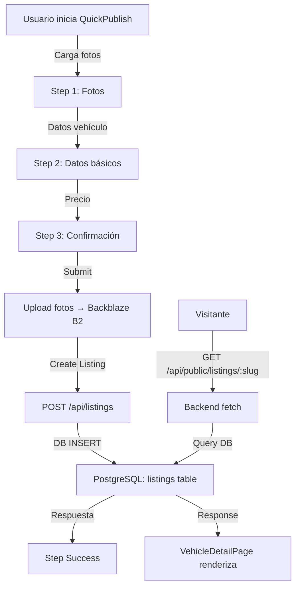

# SimpleAutos - Arquitectura Completa de Publicaciones

## Resumen Ejecutivo
SimpleAutos es una plataforma de compraventa, arriendo y subastas de vehículos. El flujo de publicaciones sigue un modelo de 3 pasos (fotos → datos básicos → confirmación) que almacena datos en PostgreSQL y archivos de imágenes en Backblaze B2.

---

## 1. FORMULARIO PRINCIPAL DE CREACIÓN/EDICIÓN (QuickPublish Flow)

### 📍 Ubicación: `apps/simpleautos/src/components/quick-publish/`

#### Componentes Principales:
| Componente | Archivo | Responsabilidad |
|---|---|---|
| **QuickPublishFlow** | `QuickPublishFlow.tsx` | Contenedor principal con manejo de estado, progreso (Steps 1-3 + Success) |
| **Step1Photos** | `Step1Photos.tsx` | Carga de fotos con drag-and-drop, reordenamiento (máx 20 fotos) |
| **Step2BasicData** | `Step2BasicData.tsx` | Formulario de datos: marca, modelo, año, versión, color, km, transmisión, etc. |
| **Step3Preview** | `Step3Preview.tsx` | Preview de datos antes de publicar |
| **Step3Pricing** | `Step3Pricing.tsx` | Definición de precio, oferta y financiamiento |
| **Step3Text** | `Step3Text.tsx` | Generación automática de titulo/descripción |
| **StepSuccess** | `StepSuccess.tsx` | Confirmación de publicación exitosa |
| **ProgressBar** | `ProgressBar.tsx` | Indicador visual de progreso |
| **PreviewPanel** | `PreviewPanel.tsx` | Panel lateral mostrando preview en tiempo real |

#### Hook Principal: `apps/simpleautos/src/hooks/useQuickPublish.ts`

**Responsabilidades:**
- Gestiona el estado de cada paso (`step: 1 | 2 | 3 | 'success'`)
- Almacena fotos en sessionStorage (`PHOTOS_KEY = 'qp-photos-v1'`)
- Almacena borrador en sessionStorage (`DRAFT_KEY = 'qp-draft-v1'`)
- Sincroniza borradores con servidor (API `/api/listing-draft`)
- Persiste datos temporales a través de navegación

**Métodos principales:**
```typescript
- goToStep(step: number): void
- addPhotos(files: File[]): void
- removePhoto(photoId: string): void
- reorderPhotos(photos: QuickPhoto[]): void
- submitBasicData(data: QuickBasicData): Promise<void>
- reset(): void
- savePanelListingDraft(): Promise<void>
- fetchPanelListingDraft(): Promise<DraftData | null>
```

#### Tipos de Datos (tipos.ts):
```typescript
type QuickPhoto = {
    id: string;
    previewUrl?: string;
    dataUrl?: string;
    file?: File;
    guidedSlot?: string; // 'cover', 'front', 'rear', etc.
};

type QuickBasicData = {
    listingType: 'sale' | 'rent' | 'auction';
    vehicleType?: 'car';
    brandId: string;
    customBrand: string;
    modelId: string;
    customModel: string;
    year: number;
    version: string;
    color?: string;
    mileage: string; // ej: "50000" km
    condition?: string;
    bodyType?: string;
    fuelType?: string;
    transmission: 'automatic' | 'manual';
    traction?: string;
};

type GeneratedText = {
    titulo: string;
    descripcion: string;
};
```

---

## 2. ESTRUCTURA DE DATOS EN BASE DE DATOS

### 📍 Archivo: `services/api/src/db/schema.ts`

#### Tabla `listings` (Principal):
```sql
CREATE TABLE listings (
  id UUID PRIMARY KEY DEFAULT random_uuid(),
  owner_id UUID NOT NULL REFERENCES users(id),
  vertical VARCHAR(20) NOT NULL, -- 'autos' | 'propiedades'
  section VARCHAR(20) NOT NULL, -- 'sale' | 'rent' | 'auction'
  title VARCHAR(255) NOT NULL,
  description TEXT,
  price_label VARCHAR(100), -- ej: "$ 25.000.000"
  location VARCHAR(255),
  location_data JSONB, -- GeoPoint {latitude, longitude, precision, provider}
  href_slug VARCHAR(255) UNIQUE, -- URL slug
  status VARCHAR(20) DEFAULT 'draft', -- 'draft'|'active'|'paused'|'sold'|'archived'
  raw_data JSONB NOT NULL, -- Datos completos incluyendo fotos
  created_at TIMESTAMP DEFAULT NOW(),
  updated_at TIMESTAMP DEFAULT NOW(),
  expires_at TIMESTAMP
);

-- Índices
PRIMARY KEY (id)
UNIQUE (href_slug)
```

**Contenido de `raw_data` (JSONB):**
```javascript
{
  "setup": {
    "listingType": "sale",
    "vehicleType": "car"
  },
  "basic": {
    "brandId": "toyota",
    "customBrand": "",
    "modelId": "corolla",
    "customModel": "",
    "title": "Toyota Corolla 2020 - Automático",
    "description": "Excelente estado, un dueño, mantención al día...",
    "year": 2020,
    "version": "XLE",
    "versionMode": "catalog",
    "color": "Blanco",
    "mileage": "45000",
    "condition": "excellent",
    "bodyType": "sedan",
    "fuelType": "gasoline",
    "transmission": "automatic",
    "traction": "front"
  },
  "pricing": {
    "price": "$ 25.000.000",
    "offerPrice": "$ 24.000.000",
    "offerPriceMode": "$",
    "negotiable": true,
    "financingAvailable": true
  },
  "media": {
    "photos": [
      {
        "id": "photo-uuid-1",
        "url": "https://b2.backblazeb2.com/file/simpleautos-bucket/...",
        "guidedSlot": "cover",
        "order": 0
      },
      // ... más fotos
    ]
  }
}
```

#### Tabla `listing_drafts` (Borradores):
```sql
CREATE TABLE listing_drafts (
  id UUID PRIMARY KEY,
  user_id UUID NOT NULL REFERENCES users(id),
  vertical VARCHAR(20) NOT NULL, -- 'autos'
  draft_data JSONB NOT NULL,
  created_at TIMESTAMP DEFAULT NOW(),
  updated_at TIMESTAMP DEFAULT NOW(),
  
  UNIQUE (user_id, vertical)
);
```

#### Tabla `saved_listings` (Favoritos):
```sql
CREATE TABLE saved_listings (
  id UUID PRIMARY KEY,
  user_id UUID NOT NULL,
  listing_id UUID NOT NULL REFERENCES listings(id),
  saved_at TIMESTAMP DEFAULT NOW(),
  
  UNIQUE (user_id, listing_id)
);
```

#### Tabla `listing_leads` (Interés de comprador):
```sql
CREATE TABLE listing_leads (
  id UUID PRIMARY KEY,
  listing_id UUID NOT NULL REFERENCES listings(id),
  owner_user_id UUID NOT NULL,
  buyer_user_id UUID,
  source VARCHAR(50), -- 'internal_form', 'whatsapp', etc.
  channel VARCHAR(20), -- 'lead', 'message', 'social', 'portal'
  email VARCHAR(255),
  phone VARCHAR(20),
  message TEXT,
  status VARCHAR(20) DEFAULT 'new', -- 'new'|'contacted'|'qualified'|'closed'
  created_at TIMESTAMP,
  updated_at TIMESTAMP
);
```

---

## 3. COMPONENTE DE VISUALIZACIÓN PÚBLICA (Detail Page)

### 📍 Ubicación: `apps/simpleautos/src/app/vehiculo/[slug]/page.tsx`
Componente: **VehicleDetailPage**

#### Estructura:
```typescript
export default function VehicleDetailPage() {
  const params = useParams<{ slug: string }>();
  const [item, setItem] = useState<PublicListing | null>(null);
  
  // Recupera datos vía API
  useEffect(() => {
    void (async () => {
      const nextItem = await fetchPublicListing(slug);
      setItem(nextItem);
    })();
  }, [slug]);
  
  return (
    <div className="container-app py-8">
      // Breadcrumbs navegación
      // Galería de imágenes
      // Título + ubicación
      // Summary (badges de datos)
      // Métricas (vistas, guardados, actualizado hace X)
      // Descripción completa
      // Tarjeta de contacto (PublicListingContactCard)
      // JSON-LD (Schema.org)
    </div>
  );
}
```

### Componente Complementario: `PublicListingContactCard`
📍 `apps/simpleautos/src/components/listings/public-listing-contact-card.tsx`

Muestra:
- Nombre del vendedor
- Foto de perfil
- Email / Teléfono / WhatsApp
- Botones CTA: "Más información", "Contactar", "Guardar"

---

## 4. RUTAS/ENDPOINTS API RELACIONADOS

### 📍 Archivo: `services/api/src/index.ts` (Hono Framework)

#### A. LECTURAS (GET)

| Endpoint | Descripción | Autenticación | Retorna |
|---|---|---|---|
| `GET /api/public/listings` | Lista publicaciones públicas | ❌ No | `{ok, items: PublicListing[]}` |
| `GET /api/public/listings/:slug` | Detalle de 1 publicación | ❌ No | `{ok, item: PublicListing}` |
| `GET /api/public/profiles/:slug` | Perfil público vendedor | ❌ No | `{ok, profile: PublicProfile, listings: PublicListing[]}` |
| `GET /api/listings` | Mis publicaciones (panel) | ✅ Sí | `{ok, items: PanelListing[]}` |
| `GET /api/listings/:id` | Detalle de mi publicación | ✅ Sí | `{ok, item: PanelListing}` |
| `GET /api/listing-draft` | Borrador guardado | ✅ Sí | `{ok, item: DraftRecord}` |
| `GET /api/saved` | Mis publicaciones guardadas | ✅ Sí | `{ok, items: SavedListingRecord[]}` |

#### B. CREACIÓN/EDICIÓN (POST/PUT)

| Endpoint | Método | Descripción | Body | Retorna |
|---|---|---|---|---|
| `POST /api/listings` | POST | Crear nueva publicación | `CreatePanelListingInput` | `{ok, item: PanelListing}` |
| `PUT /api/listings/:id` | PUT | Actualizar publicación | `UpdatePanelListingInput` | `{ok, item: PanelListing}` |
| `POST /api/listings/:id/integrations/publish` | POST | Publicar en portal (Yapo, ML, etc) | `{portal: 'yapo'\|'mercadolibre'\|...}` | `{ok, integration: ListingPortalSync}` |
| `POST /api/listings/:id/renew` | POST | Renovar publicación expirada | `{}` | `{ok, item: PanelListing}` |
| `PUT /api/listing-draft` | PUT | Guardar borrador | `DraftData` | `{ok, item: DraftRecord}` |
| `DELETE /api/listing-draft` | DELETE | Eliminar borrador | `{}` | `{ok: true}` |

#### C. MEDIA/UPLOAD (POST)

| Endpoint | Descripción | Body (FormData) | Retorna |
|---|---|---|---|
| `POST /api/media/upload` | Subir imagen/video | `File`, `fileType`, `listingId?` | `{ok, result: StorageUploadResult}` |

**Estructura StorageUploadResult:**
```typescript
{
  fileId: string;        // ID en Backblaze
  url: string;           // URL pública completa
  publicUrl: string;     // Igual a url
  fileName: string;      // Nombre original
  mimeType: string;      // ej: 'image/jpeg'
  sizeBytes: number;
  uploadedAt: number;    // Timestamp
}
```

#### D. LEADS/INTERÉS (POST)

| Endpoint | Descripción | Body | Retorna |
|---|---|---|---|
| `POST /api/listing-leads` | Registrar interés de comprador | `{listingId, email, phone, message}` | `{ok, item: ListingLeadRecord}` |
| `POST /api/listing-leads/actions` | Acción de contacto (WhatsApp/Email) | `{leadId, source, targetPhone}` | `{ok}` |

---

## 5. FLUJO COMPLETO DE PUBLICACIÓN (Datos y Almacenamiento)

```
┌─────────────────────────────────────────────────────────────┐
│ 1. USUARIO INICIA FORMULARIO (QuickPublishFlow)             │
├─────────────────────────────────────────────────────────────┤
│ • SessionStorage: PHOTOS_KEY = []                           │
│ • SessionStorage: DRAFT_KEY = {step: 1, ...}                │
└─────────────────────────────────────────────────────────────┘
                          ⬇️
┌─────────────────────────────────────────────────────────────┐
│ 2. STEP 1: CARGA DE FOTOS (Step1Photos)                     │
├─────────────────────────────────────────────────────────────┤
│ • Drag & Drop upload → File[] → processQuickFile()          │
│ • Genera dataURL o previewUrl                               │
│ • Almacena en SessionStorage: PHOTOS_KEY                    │
│ • Máximo 20 fotos                                           │
│ • Permitir reordenamiento con DnD-Kit                       │
└─────────────────────────────────────────────────────────────┘
                          ⬇️
┌─────────────────────────────────────────────────────────────┐
│ 3. STEP 2: DATOS BÁSICOS (Step2BasicData)                   │
├─────────────────────────────────────────────────────────────┤
│ • Formulario con campos:                                    │
│   - Tipo de vehículo (marca, modelo, año, versión)          │
│   - Condición (color, km, transmisión, tracción)            │
│   - Tipo de listado (venta/arriendo/subasta)                │
│ • generateListingText() genera título/descripción auto      │
│ • SessionStorage: DRAFT_KEY actualiza con basicData         │
│ • OPCIONALMENTE: savePanelListingDraft() → API              │
└─────────────────────────────────────────────────────────────┘
                          ⬇️
┌─────────────────────────────────────────────────────────────┐
│ 4. STEP 3: CONFIRMACIÓN (Step3Preview + Step3Pricing)       │
├─────────────────────────────────────────────────────────────┤
│ • Preview completo de publicación                           │
│ • Precio, oferta, financiamiento                            │
│ • Resumen de datos                                          │
│ • SUBMIT FINAL ⬇️                                            │
└─────────────────────────────────────────────────────────────┘
                          ⬇️
┌─────────────────────────────────────────────────────────────┐
│ 5. SUBIDA DE FOTOS (uploadMedia)                             │
├─────────────────────────────────────────────────────────────┤
│ • Para cada foto en PHOTOS_KEY:                             │
│   - uploadMediaFile(file, {fileType: 'image'})              │
│   - POST /api/media/upload (FormData)                       │
│   - ⬇️ Backend Hono (requireVerifiedSession)                 │
│        - getStorageProvider() → BackblazeB2Provider         │
│        - fileName = "${userId}/${listingId}/${ts}-${name}"  │
│        - Carga a Backblaze B2                               │
│        - Retorna {fileId, url, ...}                         │
└─────────────────────────────────────────────────────────────┘
                          ⬇️
┌─────────────────────────────────────────────────────────────┐
│ 6. CREAR PUBLICACIÓN EN DB (createPanelListing)              │
├─────────────────────────────────────────────────────────────┤
│ • POST /api/listings                                        │
│ • Body:                                                     │
│   {                                                         │
│     vertical: 'autos',                                      │
│     listingType: 'sale|rent|auction',                       │
│     title: "Toyota Corolla...",                             │
│     description: "Excelente estado...",                     │
│     priceLabel: "$ 25.000.000",                             │
│     location: "Ñuñoa, Región Metropolitana",                │
│     locationData: {sourceMode, geoPoint, ...},             │
│     rawData: {                                              │
│       setup: {...},                                         │
│       basic: {...},                                         │
│       pricing: {...},                                       │
│       media: {                                              │
│         photos: [{url, guidedSlot, order}, ...]           │
│       }                                                     │
│     }                                                       │
│   }                                                         │
│ • ⬇️ Backend:                                                │
│      - INSERT INTO listings (...)                           │
│      - ID / href_slug generado                              │
│      - status = 'active'                                    │
│      - raw_data guardado como JSONB                         │
└─────────────────────────────────────────────────────────────┘
                          ⬇️
┌─────────────────────────────────────────────────────────────┐
│ 7. RESPUESTA EXITOSA (StepSuccess)                           │
├─────────────────────────────────────────────────────────────┤
│ • Mostrar confirmación con link a publicación               │
│ • Limpiar SessionStorage                                    │
│ • Opción redirigir a /panel o /vehiculo/[slug]             │
└─────────────────────────────────────────────────────────────┘
```

---

## 6. ALMACENAMIENTO DE FOTOS (Backblaze B2)

### 📍 Proveedor: `services/api/src/storage-providers/backblaze-b2.ts`

#### Clase: `BackblazeB2Provider`

**Configuración:**
```typescript
new BackblazeB2Provider(
  appKeyId: string,      // process.env.BACKBLAZE_APP_KEY_ID
  appKey: string,        // process.env.BACKBLAZE_APP_KEY
  bucketId: string,      // process.env.BACKBLAZE_BUCKET_ID
  bucketName: string,    // 'simpleautos-listings'
  downloadUrl: string    // 'https://f001.backblazeb2.com'
);
```

**Métodos principales:**

1. **`async upload(input: StorageUploadInput): Promise<StorageUploadResult>`**
   ```typescript
   input: {
     file: File | Buffer;
     fileName: string;
     mimeType: string;
     userId: string;
     listingId?: string;
   }
   
   // Ruta en B2:
   // {bucketName}/[userId]/[listingId || 'temp']/[timestamp]-[fileName]
   // Ej: simpleautos-listings/uuid-user/uuid-listing/1711276800000-car_photo.jpg
   ```

2. **`async delete(fileId: string): Promise<void>`**
   - Elimina archivo por ID

3. **`getUrl(fileId: string): string`**
   - Genera URL pública

**Flujo de autenticación:**
```
1. authorize() → POST https://api001.backblazeb2.com/b2api/v3/auth/authorize
   └─ Header: Authorization: Basic [base64(appKeyId:appKey)]
   └─ Retorna: {authorizationToken, apiUrl}
   └─ Token válido 24h (refresh después 23h)

2. getUploadUrl() → POST {apiUrl}/b2api/v3/b2_get_upload_url
   └─ Header: Authorization: {authToken}
   └─ Retorna: {uploadUrl, authorizationToken}

3. Upload → POST {uploadUrl}
   └─ Header: X-Bz-File-Name: {urlEncodedPath}
   └─ Body: Binary file data
```

**URLs públicas generadas:**
```
https://f001.backblazeb2.com/file/simpleautos-listings/
  {userId}/{listingId || 'temp'}/{timestamp}-{fileName}

Ejemplo:
https://f001.backblazeb2.com/file/simpleautos-listings/
  550e8400-e29b-41d4-a716-446655440000/
  5f3e6d20-a5b2-4e8c-9f1a-3b8a7c4d6e2f/
  1711276800000-DSC_0001.jpg
```

---

## 7. ESTRUCTURA DE PUBLI PÚBLICA (PublicListing)

### 📍 Archivo: `apps/simpleautos/src/lib/public-listings.ts`

```typescript
export type PublicListing = {
  // Identitarios
  id: string;                    // UUID
  vertical: 'autos';
  section: 'sale' | 'rent' | 'auction';
  sectionLabel: string;          // "Venta" | "Arriendo" | "Subasta"
  
  // Contenido
  title: string;                 // Ej: "Toyota Corolla 2020"
  description: string;           // Texto largo
  price: string;                 // Ej: "$ 25.000.000"
  href: string;                  // Ej: "/vehiculo/toyota-corolla-2020-abc123"
  
  // Ubicación
  location: string;              // Ej: "Ñuñoa, Región Metropolitana"
  
  // Métricas
  views: number;
  favs: number;                  // Saved/favoritos
  leads: number;                 // Interés registrados
  days: number;                  // Días publicada
  publishedAgo: string;          // "Hace 3 días"
  updatedAt: number;             // Timestamp
  
  // Media
  images: string[];              // URLs completas de imágenes
  summary: string[];             // Tags: ["2020", "121 mil km", "Automático"]
  
  // Vendedor
  seller: {
    id: string;
    name: string;
    username: string;
    profileHref: string | null;
    email: string;
    phone: string | null;
  } | null;
};
```

**Funciones de fetch:**

```typescript
export async function fetchPublicListings(
  section?: 'sale' | 'rent' | 'auction'
): Promise<PublicListing[]>
// GET /api/public/listings?vertical=autos&section={section}

export async function fetchPublicListing(
  slug: string
): Promise<PublicListing | null>
// GET /api/public/listings/{slug}?vertical=autos

export async function fetchPublicProfile(
  username: string
): Promise<{profile: PublicProfile; listings: PublicListing[]} | null>
// GET /api/public/profiles/{username}?vertical=autos
```

---

## 8. PANEL ADMINISTRATIVO (Mi Panel)

### 📍 Rutas:
- `apps/simpleautos/src/app/panel/` - Layout principal
- `apps/simpleautos/src/components/panel/` - Componentes reutilizables

### Tipos de panel:
| Ruta | Componente | Responsabilidad |
|---|---|---|
| `/panel` | Panel Shell | Navegación principal |
| `/panel/mis-publicaciones` | Listing Manager | CRUD de publicaciones |
| `/panel/publicar` | QuickPublishFlow | Crear nueva publicación |
| `/panel/leads` | CRM + Leads | Gestionar interés de compradores |
| `/panel/mensajes` | Messages | Chat con compradores |
| `/panel/perfil` | Profile Editor | Datos de perfil público |
| `/panel/suscripción` | Subscription Manager | Plan de pago |

### Endpoints del Panel:

```typescript
// Mis publicaciones
GET /api/listings?vertical=autos&mine=true
POST /api/listings
PUT /api/listings/:id
GET /api/listings/:id

// Portal sync (Yapo, Mercadolibre, etc)
POST /api/listings/:id/integrations/publish

// Leads recibidos
GET /api/crm/listing-leads
GET /api/crm/listing-leads/:id
POST /api/crm/listing-leads/:id/notes
POST /api/crm/listing-leads/:id/actions

// Cargar borradores
GET /api/listing-draft
PUT /api/listing-draft
DELETE /api/listing-draft
```

---

## 9. TIPOS DE SECCIONES

```typescript
type ListingSection = 'sale' | 'rent' | 'auction' | 'project';

// SimpleAutos usa solo:
- 'sale' → Venta de vehículos → /ventas
- 'rent' → Arriendo de vehículos → /arriendos
- 'auction' → Subasta de vehículos → /subastas
```

---

## 10. INTEGRACIONES EXTERNAS

### Portales de listado:
| Portal | Endpoint Sync | Schema |
|---|---|---|
| **Yapo** | `POST /api/listings/:id/integrations/publish` | `{portal: 'yapo'}` |
| **Mercado Libre** | `POST /api/listings/:id/integrations/publish` | `{portal: 'mercadolibre'}` |
| **Chile Autos** | `POST /api/listings/:id/integrations/publish` | `{portal: 'chileautos'}` |
| **Facebook** | `POST /api/listings/:id/integrations/publish` | `{portal: 'facebook'}` |

### Instagram Publishing:
```typescript
POST /api/integrations/instagram/publish
Body: {listingId, captionOverride?}
// Expone: /api/integrations/instagram/listing-image/:id
```

---

## 11. ACCIONES DE USUARIO (Actions)

### 📍 Archivo: `apps/simpleautos/src/actions/`

| Acción | Archivo | Descripción |
|---|---|---|
| `generateListingText()` | `generate-listing-text.ts` | Genera título/descripción automática con IA |
| `detectVehicleColor()` | `detect-vehicle-color.ts` | Detecta color del auto en foto |
| `getPriceReference()` | `get-price-reference.ts` | Obtiene precio de referencia para modelo |

Ejemplo:
```typescript
// Action server-side
const text = await generateListingText({
  brandId: 'toyota',
  modelId: 'corolla',
  year: 2020,
  mileage: '45000',
  version: 'XLE'
});
// Retorna: {titulo: "Toyota Corolla 2020 XLE...", descripcion: "..."}
```

---

## 12. SEGURIDAD Y VALIDACIÓN

### Autenticación:
- **Cookies con JWT** (seteadas en POST /api/auth/login)
- **requireVerifiedSession** middleware en rutas protegidas
- **Google OAuth** disponible (POST /api/auth/google/callback)

### Validación de entrada:
- Zod schemas para todos los endpoints
- Tipos TypeScript validados

### Rate limiting:
- Implementado para rutas de auth

---

## 13. CACHÉ Y PERFORMANCE

### SessionStorage (Frontend):
```javascript
PHOTOS_KEY = 'qp-photos-v1'          // Fotos en draft
DRAFT_KEY = 'qp-draft-v1'            // Estado del formulario
```

### Maps en memoria (Backend):
```javascript
listingsById: Map<id, ListingRecord>
savedListings: Map<userId, SavedListingRecord[]>
listingLeadCounts: Map<listingId, number>
// Se cargan al startup desde DB
```

---

## 14. CUOTA DE SUSCRIPCIÓN

Planes disponibles (por vertical 'autos'):
```typescript
- free: {maxListings: 3, maxImagesPerListing: 5}
- basic: {maxListings: 20, maxImagesPerListing: 20}
- pro: {maxListings: 100, maxImagesPerListing: 50}
- enterprise: {maxListings: -1, maxImagesPerListing: -1}
```

Validado durante POST /api/listings.

---

## REFERENCIAS RÁPIDAS

### Rutas clave:
```
Frontend: apps/simpleautos/src/
├── app/vehiculo/[slug]/page.tsx     (Detalle público)
├── app/panel/                        (Panel admin)
├── components/quick-publish/         (Formulario)
├── hooks/useQuickPublish.ts          (Logic principal)
└── lib/public-listings.ts            (API client)

Backend: services/api/src/
├── index.ts                          (Todos los endpoints)
├── db/schema.ts                      (BD schema)
├── storage-providers/backblaze-b2.ts (Cloud storage)
└── db/index.ts                       (Drizzle ORM setup)
```

### Endpoints críticos:
- **GET** `/api/public/listings/:slug` - Ver publicación
- **POST** `/api/listings` - Crear publicación
- **POST** `/api/media/upload` - Subir imagen
- **POST** `/api/listing-leads` - Registrar interés

### Base de datos:
- **PostgreSQL** con Drizzle ORM
- Tabla principal: `listings`
- Datos completos en columna `raw_data` (JSONB)

---

## Diagrama de Flujo Resumido



---

**Última actualización:** 29 de marzo de 2026
**Versión:** 2.0 (SimpleAutos v2)
