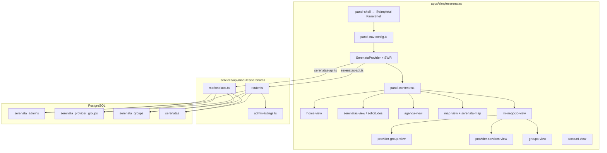

# Auditoría técnica experto — Monorepo Simple

**Fecha:** 18 de mayo de 2026 (actualizado: anexo panel admin Serenatas)  
**Alcance:** `apps/*`, `packages/*`, `services/api`, `scripts/`, configuración de deploy, documentación activa  
**Última pasada focalizada:** Simple Serenatas — menú dueño (`home`, `solicitudes`, `agenda`, `map`, `mi-negocio`, `profile`) — ver **§ Anexo A**  
**Modo:** Solo lectura (sin modificación de código de aplicación)  
**Verificación ejecutada:** `pnpm run typecheck` monorepo · `pnpm --filter @simple/api test` (40 tests) · `pnpm --filter @simple/serenatas exec tsc --noEmit` (pasada 6, mayo 2026) · journal/SQL Drizzle **51/51** ✅ · `index.ts` **~8.109** líneas (pasada 6, −~732 vs pasada 16 por extracción valuation)

---

## 1. Resumen ejecutivo

El monorepo **Simple** mantiene un núcleo multi-vertical operativo (Admin, Plataforma, Autos, Propiedades, Agenda) con backend Hono + PostgreSQL/Drizzle y frontends Next.js 16 que comparten `@simple/ui`, `@simple/auth` y paquetes de dominio. **SimpleSerenatas** está en pivot activo hacia **marketplace de grupos proveedores** (migración `0049`, módulo `marketplace.ts`, SPA con rutas `panel/[[...slug]]`), con typecheck en verde.

Tras fixes recientes, varios riesgos operativos graves quedaron **mitigados en repo**: secretos purgados de `COOLIFY_DEPLOYMENT.md`, webhook Mercado Pago de Agenda con verificación HMAC, Dockerfile Serenatas alineado a multi-stage standalone, CORS de producción documentado con dominios Serenatas, README/ARCHITECTURE actualizados, y páginas de direcciones Autos/Propiedades centralizadas en `@simple/ui`.

Los riesgos transversales que **persisten** son estructurales: **`services/api/src/index.ts` (~9.8k líneas tras Pasada 16)**, **caché en memoria al arranque** (`loadDataFromDB` + Maps, con hidratación parcial de `payment_orders` y lectura DB-first en confirm + `GET /payments/orders*`), **rate limiting en proceso**, y **cobertura E2E** (smoke público + `admin-flow.spec.ts` con creds; job `e2e-serenatas-real` opt-in). El webhook MP para checkout compartido (`POST /api/payments/mercadopago/webhook`) cubre autos/propiedades/serenatas; Agenda mantiene ruta OAuth propia. El marketplace 0049 requiere validación E2E en staging (**no confirmado** en producción).

**Veredicto:** **Parcialmente listo para producción** en verticales consolidadas; **endurecimiento de API distribuida, pagos y QA del marketplace Serenatas** antes de tratar el pivot como producción crítica.

---

## 2. Estado técnico real del repo

| Área | Estado | Notas |
|------|--------|-------|
| Monorepo pnpm | Operativo | Workspaces: `apps/simple*`, `packages/*`, `services/*` |
| Typecheck API | ✅ Pasa | Ejecutado en esta auditoría |
| Typecheck SimpleSerenatas | ✅ Pasa | Ejecutado en esta auditoría |
| Typecheck monorepo completo | ✅ Pasa | `pnpm run typecheck` (pasada 6); SimpleSerenatas sin error `SIMPLE_APPS` (`getSimpleAppBrand`) |
| Migraciones Drizzle | Alineadas | **51** entradas `_journal.json` = **51** `.sql`; incluye `0049_serenata_provider_marketplace` |
| Tests automatizados | Muy bajo | 7 archivos `*.{test,spec}.{ts,tsx}` en todo el repo |
| Fixes recientes (ops/seguridad) | Mayormente aplicados | Ver tabla re-auditoría abajo |
| Deploy Serenatas | Mejorado | Dockerfile multi-stage + sección COOLIFY §7 |
| Deuda API estructural | Crítica pendiente | God file + Maps en memoria |

### Re-auditoría post-fixes (estado actual)

| Ítem reportado previamente | Estado en código (mayo 2026) | Evidencia |
|----------------------------|--------------------------------|-----------|
| Secretos Coolify en doc versionada | **Mitigado** | `docs/COOLIFY_DEPLOYMENT.md`: placeholders + aviso de rotación; sin `pass:` ni tokens reales |
| Webhook MP Agenda sin firma | **Resuelto** | `agenda/router.ts` llama `verifyMercadoPagoWebhookSignature` y rechaza con 401 si firma inválida |
| Dockerfile Serenatas minimal | **Resuelto** | `apps/simpleserenatas/Dockerfile`: deps → builder (`@simple/ui` + build) → runner standalone |
| CORS Serenatas ausente en COOLIFY | **Resuelto** | `CORS_ORIGINS` incluye `simpleserenatas.app` y `www` |
| README/ARCHITECTURE sin Serenatas | **Resuelto** | README puerto 3005; ARCHITECTURE lista `simpleserenatas :3005` |
| Páginas direcciones duplicadas Autos/Propiedades | **Resuelto** | Re-export `PanelAddressesPage` desde `@simple/ui` |
| God file `index.ts` | **En progreso** | **~2.66k** líneas (pasada pendientes 18); extracción suscripciones, CRM/messages bindings, cuentas |
| Caché Maps al arranque | **Pendiente** | `loadDataFromDB()` ~1422+; invocado en arranque ~11920 |
| Tests marketplace / API | **Pendiente** | Sin tests en `marketplace.ts` ni flujos MP |
| Migración 0049 en prod | **No confirmado** | Schema y rutas existen; requiere verificación en DB desplegada |

> **Nota operativa:** Si secretos estuvieron alguna vez en git remoto, la purga del doc **no sustituye** la rotación en Coolify y proveedores externos.

---

## 3. Mapa de arquitectura

```text
┌─────────────────────────────────────────────────────────────────────────┐
│                         apps/ (Next.js 16 + React 19)                    │
├──────────────┬──────────────┬──────────────┬──────────────┬────────────┤
│ simpleadmin  │simpleplataf. │ simpleautos  │simplepropied.│simpleagenda│
│   :3000      │   :3001      │   :3002      │   :3003      │   :3004    │
├──────────────┴──────────────┴──────────────┴──────────────┴────────────┤
│ simpleserenatas :3005  ← marketplace grupos (0049, SPA panel/[[...slug]]) │
└───────────────────────────────┬─────────────────────────────────────────┘
                                │ fetch + cookie simple_session
                                ▼
┌─────────────────────────────────────────────────────────────────────────┐
│              services/api (Hono) :4000 — index.ts + modules/*            │
│  Routers: auth, listings, serenatas(+marketplace), agenda, admin, crm,   │
│  payments, instagram, media, boost, valuation, …                          │
│  Arranque: migrate() + applyPostJournalMigrations + loadDataFromDB()     │
└───────────────────────────────┬─────────────────────────────────────────┘
                                ▼
                    PostgreSQL (Drizzle ORM)
                    Storage: local | cloudflare-r2 | backblaze-* (legacy)

packages/
  @simple/ui (dist/)     @simple/auth    @simple/config    @simple/types
  @simple/utils          @simple/logger   @simple/listings-core (src/)
  @simple/marketplace-header
```

**SimpleSerenatas (pivot marketplace):**

- **DB:** `serenata_provider_groups`, `serenata_group_services`, FKs en `serenatas` (`0049`).
- **API:** `modules/serenatas/marketplace.ts` — rutas públicas `/marketplace/groups`, CRUD proveedor, creación/aceptación marketplace.
- **UI:** `groups-marketplace-view`, `provider-group-view`, `marketplace-request-view`; direcciones en `addresses-section` dentro de cuenta (no página Next separada).

---

## 4. Problemas críticos

### [CRÍTICO] God file `index.ts` (~10.941 líneas)
- **Path:** `services/api/src/index.ts`
- **Descripción:** La mayor parte de helpers, lógica legacy de listings, valuación, email, SVG templates y composición de deps vive en un solo archivo; `const app = new Hono()` aparece ~línea 10845, después de miles de líneas de funciones.
- **Impacto:** Regresiones difíciles de detectar, reviews inviables, conflictos de merge, tests unitarios granulares impracticables.
- **Evidencia:** 10.941 líneas medidas; routers modulares montados al final vía `app.route()` pero el cuerpo central sigue monolítico.
- **Recomendación:** Plan incremental: extraer dominios restantes a `modules/*` (patrón `serenatas`, `agenda/router`); dejar `index.ts` solo como bootstrap y wiring de deps.
- **Riesgo si no se corrige:** Velocidad de entrega cae; bugs de alto impacto en cada release.

### [CRÍTICO] Caché en memoria de datos de negocio al arranque
- **Path:** `services/api/src/index.ts` (`usersById`, `listingsById`, `paymentOrdersByUser`, `loadDataFromDB` ~1422+)
- **Descripción:** En cada arranque se cargan usuarios, listings, cuentas, perfiles, etc. en `Map`; gran parte de la lógica legacy lee/escribe estos Maps además de PostgreSQL.
- **Impacto:** Con múltiples réplicas API, cada instancia tiene estado distinto hasta reinicio; lecturas obsoletas y condiciones de carrera en pagos/listings.
- **Evidencia:** Maps ~1401–1419; `loadDataFromDB()` en bloque de arranque ~11920; `PaymentsRouterDeps` inyecta `paymentOrdersByUser: Map`.
- **Recomendación:** Inventariar endpoints que mutan Maps; migrar a Drizzle o caché distribuida (Redis) con invalidación explícita.
- **Riesgo si no se corrige:** Bugs intermitentes bajo escalado horizontal y pérdida de confianza en datos.

---

## 5. Problemas altos

### [ALTO] Pagos Autos/Propiedades/Serenatas sin webhook servidor (solo confirmación cliente)
- **Path:** `services/api/src/modules/payments/router.ts` (`POST /payments/confirm`); ausencia de `POST` webhook global en `modules/payments` y `modules/mercadopago`
- **Descripción:** Tras checkout MP, la activación de suscripciones/boost/serenata depende de que el frontend llame `/payments/confirm` con `paymentId`. No hay endpoint IPN para verticales listing como sí existe para Agenda (`/api/agenda/mercadopago/webhook`).
- **Impacto:** Pagos aprobados en MP pero no confirmados en Simple si el usuario cierra el browser; órdenes en estado intermedio en Maps/DB.
- **Evidencia:** `grep webhook` en `services/api/src` → único uso de firma MP en `agenda/router.ts`; `payments/router.ts` solo `checkout` + `confirm`.
- **Recomendación:** Añadir webhook firmado reutilizando `verifyMercadoPagoWebhookSignature` + idempotencia por `paymentId`; mantener `confirm` como fallback.
- **Riesgo si no se corrige:** Pérdida de ingresos y soporte manual de pagos huérfanos.

### [ALTO] Orígenes CORS de Serenatas no están en defaults del código
- **Path:** `services/api/src/index.ts` (`getAllowedOrigins` ~9223–9247)
- **Descripción:** Los defaults incluyen localhost 3000–3004 y dominios prod de otras apps, pero **no** `http://localhost:3005` ni `https://simpleserenatas.app`. Dependen de `CORS_ORIGINS` en env (documentado en COOLIFY y `.env.example`).
- **Impacto:** Deploy sin variable completa → auth con cookies falla en browser para Serenatas.
- **Evidencia:** `getAllowedOrigins` sin `3005`/`simpleserenatas`; `.env.example` sí lista `:3005`.
- **Recomendación:** Añadir Serenatas a defaults de código además de env; smoke test CORS en CI.
- **Riesgo si no se corrige:** Marketplace inutilizable si operador omite una variable.

### [ALTO] Rate limiting en memoria (no compatible con réplicas)
- **Path:** `services/api/src/lib/rate-limit.ts`; `authRateLimitBuckets` en `index.ts`
- **Descripción:** Buckets en `Map` por proceso; sin Redis/edge compartido.
- **Impacto:** Límite efectivo ≈ `limit × N réplicas`; brute-force auth distribuido evade protección.
- **Evidencia:** `rate-limit.ts` líneas 8–55; uso en Agenda y auth global.
- **Recomendación:** Rate limit en proxy (Cloudflare/Coolify) + store compartido para `/api/auth/*`.
- **Riesgo si no se corrige:** Abuso de endpoints sensibles bajo carga.

### [ALTO] Cobertura de tests insignificante
- **Path:** Repo global (7 archivos test/spec)
- **Descripción:** Sin tests de API Serenatas marketplace, webhooks MP, pagos ni flujos auth de integración.
- **Impacto:** Regresiones en pivot 0049 y parche webhook Agenda no detectadas en CI.
- **Evidencia:** `packages/ui` (4), `packages/utils` (1), `packages/types` (1), `services/api` advertising types (1).
- **Recomendación:** Tests de contrato para `marketplace.ts`, `verifyMercadoPagoWebhookSignature`, checkout/confirm pagos.
- **Riesgo si no se corrige:** Cada release del marketplace es manual y arriesgado.

### [ALTO] Integración Instagram con analytics simulados en rutas reales
- **Path:** `services/api/src/modules/instagram/service.ts` (`getInstagramInsights` ~602–656); expuesto vía `instagram/router.ts`
- **Descripción:** Comentario «En producción, esto obtendría datos reales» pero devuelve `mockAnalytics` fijos; publicación también simula éxito en bloques del mismo archivo.
- **Impacto:** Panel/admin muestra métricas ficticias; decisiones de marketing basadas en datos incorrectos.
- **Evidencia:** `mockAnalytics` hardcodeado; router llama `deps.getInstagramInsights`.
- **Recomendación:** Feature-flag «preview/demo» vs producción; o deshabilitar endpoints hasta Graph API real.
- **Riesgo si no se corrige:** Confianza del producto y cumplimiento con expectativas de negocio.

### [ALTO] Drift storage: Coolify (Backblaze) vs plantilla API (R2)
- **Path:** `docs/COOLIFY_DEPLOYMENT.md`; `services/api/.env.example`
- **Descripción:** Runbook de deploy fija `STORAGE_PROVIDER=backblaze-s3`; ejemplo oficial prioriza `cloudflare-r2`; código soporta ambos + local.
- **Impacto:** Nuevos entornos siguen doc legacy; migración R2 no reflejada en runbook activo.
- **Evidencia:** COOLIFY bloque API vs `.env.example` líneas 31–44.
- **Recomendación:** Unificar con `docs/STORAGE_SETUP.md` como fuente única por entorno.
- **Riesgo si no se corrige:** URLs rotas y media huérfana entre proveedores.

### [ALTO] Marketplace 0049 sin validación E2E documentada
- **Path:** `services/api/drizzle/0049_serenata_provider_marketplace.sql`; `modules/serenatas/marketplace.ts`; `apps/simpleserenatas`
- **Descripción:** Modelo y rutas existen (grupos `status: active`, servicios, flujo crear/aceptar marketplace). No hay tests ni seeds verificados en repo para smoke del flujo completo.
- **Impacto:** Despliegue de front sin migración o sin grupos activos deja marketplace vacío o con errores 500.
- **Evidencia:** Migración y handlers presentes; 0 tests Serenatas en repo.
- **Recomendación:** Checklist staging: migración aplicada → seed grupo activo → cliente solicita → dueño acepta.
- **Riesgo si no se corrige:** Lanzamiento marketplace con fallos silenciosos (**estado prod: no confirmado**).

### [ALTO] Wizard publicación Autos con mapeo draft incompleto
- **Path:** `apps/simpleautos/src/app/panel/publicar/page.tsx` (~273)
- **Descripción:** TODO explícito «Mapear listing a FormData» al cargar borrador/listing existente.
- **Impacto:** UX rota o pérdida de datos al retomar publicación.
- **Evidencia:** Comentario `// TODO: Mapear listing a FormData`.
- **Recomendación:** Implementar mapeo o ocultar acción «continuar borrador» hasta estar listo.
- **Riesgo si no se corrige:** Abandono de publicadores en vertical de ingresos.

### [ALTO] Webhook MP Agenda acepta modo `unsigned` si falta secret
- **Path:** `services/api/src/modules/mercadopago/service.ts` (`verifyMercadoPagoWebhookSignature` → `'unsigned'`); `agenda/router.ts` (~1451)
- **Descripción:** Sin `MERCADO_PAGO_WEBHOOK_SECRET`, la firma no se exige; el handler puede confiar en body parcial en modo unsigned.
- **Impacto:** En staging mal configurado, riesgo residual de confirmación sin validación fuerte.
- **Evidencia:** `if (!secret) return 'unsigned'`; rama `signatureResult === 'unsigned'` lee `external_reference` del body.
- **Recomendación:** En producción exigir secret (fallar arranque si falta); rechazar unsigned salvo dev explícito.
- **Riesgo si no se corrige:** Fraude de pagos en entornos mal configurados.

---

## 6. Deuda técnica media/baja

### [MEDIO] `@simple/listings-core` exporta `src/` sin build `dist`
- **Path:** `packages/listings-core/package.json`
- **Descripción:** A diferencia de `@simple/ui`, se transpila vía `transpilePackages` en cada app.
- **Impacto:** Builds más lentos; acoplamiento a resolución Next.
- **Evidencia:** `"main": "./src/index.ts"` (patrón habitual en monorepo).
- **Recomendación:** Alinear con `dist` si el package crece.
- **Riesgo si no se corrige:** Tiempos de CI y errores de tipos en consumidores.

### [MEDIO] `primary_vertical` en schema sin modelo Serenatas
- **Path:** `services/api/src/db/schema.ts` (comentario `primary_vertical`); `packages/types/src/vertical-type.spec.ts`
- **Descripción:** Comentario solo lista `autos | propiedades | agenda`; `verticalTypeSchema` rechaza `'serenatas'`.
- **Impacto:** Confusión al modelar usuarios multi-app; admin scoped por vertical no incluye Serenatas.
- **Evidencia:** Test explícito `safeParse('serenatas').success === false`.
- **Recomendación:** Documentar que Serenatas usa perfiles propios o extender tipos si se unifica onboarding.
- **Riesgo si no se corrige:** Reglas de negocio inconsistentes.

### [MEDIO] Cron Agenda en cada réplica API
- **Path:** `services/api/src/modules/agenda/cron.ts`; invocado desde `index.ts`
- **Descripción:** `node-cron` registra recordatorios cada 5 min si producción o `AGENDA_CRON_ENABLED=true`; sin leader election visible.
- **Impacto:** N recordatorios duplicados con N réplicas (**no confirmado** en despliegue actual).
- **Evidencia:** `cron.schedule('*/5 * * * *', ...)` sin lock distribuido.
- **Recomendación:** Un solo worker/cron externo o lock Redis; endpoint cron HTTP ya soporta `CRON_SECRET`.
- **Riesgo si no se corrige:** Notificaciones duplicadas a pacientes.

### [MEDIO] Doble vía de migraciones al arranque
- **Path:** `services/api/src/index.ts` (~11900); `apply-pending-migrations.ts`
- **Descripción:** `migrate()` Drizzle (journal) + `applyPostJournalMigrations` (0046–0059) + `loadDataFromDB()`.
- **Impacto:** Correcto pero difícil de razonar para operadores.
- **Evidencia:** Bloque async de arranque documentado parcialmente en `DATABASE_SETUP.md`.
- **Recomendación:** Matriz única «cuándo usar cuál» en doc operativa.
- **Riesgo si no se corrige:** Migraciones aplicadas dos veces o en orden incorrecto.

### [MEDIO] Tipado débil en routers extraídos (`any` en deps)
- **Path:** `services/api/src/modules/payments/router.ts`, `auth/router.ts`
- **Descripción:** Deps con `any` en db/tables/schemas.
- **Impacto:** Refactors de schema sin errores en módulos.
- **Evidencia:** Firmas exportadas de routers modulares.
- **Recomendación:** Tipar con inferencia Drizzle progresivamente.
- **Riesgo si no se corrige:** Bugs silenciosos en pagos Serenatas/listings.

### [MEDIO] `ENABLE_ADMIN_BOOTSTRAP` en ejemplo local
- **Path:** `services/api/.env.local.example` vs COOLIFY (`false`)
- **Descripción:** Bootstrap admin puede quedar habilitado si se copia plantilla local a staging expuesto.
- **Impacto:** Elevación de privilegios en entornos compartidos.
- **Evidencia:** `admin/router.ts` expone `POST /bootstrap` (protegido por flag en handler — **no confirmado** comportamiento sin flag).
- **Recomendación:** Default `false` en todos los examples; auditar `handleBootstrap`.
- **Riesgo si no se corrige:** Cuenta admin no autorizada.

### [MEDIO] Rotación histórica de secretos tras exposición en git
- **Path:** Historial git / Coolify (operacional)
- **Descripción:** Doc ya no contiene secretos; si estuvieron en remoto, rotación sigue siendo obligatoria.
- **Impacto:** Acceso persistente con credenciales antiguas.
- **Evidencia:** Política en COOLIFY líneas 4–6; estado de rotación **no confirmado**.
- **Recomendación:** Confirmar rotación Coolify/MP/Google/Meta; escaneo secretos en CI.
- **Riesgo si no se corrige:** Compromiso residual de infraestructura.

### [MEDIO] Migraciones placeholder históricas (0030–0037)
- **Path:** `services/api/drizzle/003*_placeholder.sql`
- **Descripción:** Ocho migraciones vacías intencionales en journal.
- **Impacto:** Ruido operativo; riesgo si alguien las borra.
- **Evidencia:** Comentarios en cada `.sql` y `drizzle/README.md`.
- **Recomendación:** Mantener; reforzar en onboarding DB.
- **Riesgo si no se corrige:** Drift de hash en DBs antiguas.

### [BAJO] TODO en boost plan lookup
- **Path:** `services/api/src/modules/boost/service.ts` (~103)
- **Descripción:** Lookup de plan marcado como pendiente.
- **Impacto:** Pricing boost posiblemente incorrecto (**no confirmado** en runtime).
- **Evidencia:** `// TODO: Implement proper plan lookup`.
- **Recomendación:** Verificar flujo boost en staging antes de campañas.
- **Riesgo si no se corrige:** Cobros o visibilidad incorrectos.

### [BAJO] Tasas hipotecarias simuladas
- **Path:** `services/api/src/lib/updateMortgageRates.ts`
- **Descripción:** Scraper real no implementado; retorna `simulatedRates`.
- **Impacto:** Datos de tasas no reales en features que los consuman.
- **Evidencia:** Comentario placeholder y array simulado.
- **Recomendación:** Integrar fuente real o desactivar feature.
- **Riesgo si no se corrige:** Información financiera engañosa.

### [BAJO] `DATABASE_SETUP.md` con checklist histórico
- **Path:** `docs/DATABASE_SETUP.md`
- **Descripción:** Fases con `[ ]` como plan inicial sin actualizar.
- **Impacto:** Confusión para nuevos desarrolladores.
- **Recomendación:** Convertir en guía operativa actual.
- **Riesgo si no se corrige:** Procedimientos duplicados u omitidos.

### [BAJO] Artefactos `.next` untracked (simpleadmin)
- **Path:** `apps/simpleadmin/.next/` (git status)
- **Descripción:** Build local; `.gitignore` cubre `.next/`.
- **Impacto:** Bajo si no se commitea.
- **Recomendación:** Educar al equipo; confirmar CI no empaqueta builds locales.
- **Riesgo si no se corrige:** Repo hinchado accidentalmente.

---

## 7. Duplicidades/redundancias

| Duplicidad | Ubicación | Nota |
|------------|-----------|------|
| Lógica listings en API | `index.ts` Maps + `modules/listings` | Dos fuentes de verdad |
| `next.config.ts` transpilePackages | Autos / Propiedades | Casi idénticos |
| Storage providers | B2, B2-S3, R2, local | Necesario por migración; docs redundantes |
| Serenatas API | `router.ts` + `marketplace.ts` | Separación reciente (~769 líneas marketplace) |
| Direcciones panel | Agenda: página propia; Serenatas: `addresses-section`; Autos/Prop: `@simple/ui` | Tres patrones distintos por dominio |
| Confirmación de pagos | Frontend `confirm` vs webhook Agenda | Patrones divergentes entre verticales |

---

## 8. Incoherencias técnicas

- **CORS:** COOLIFY y `.env.example` completos para Serenatas; **código** `getAllowedOrigins` incompleto sin env.
- **Pagos:** Agenda usa webhook firmado; Autos/Propiedades/Serenatas dependen de confirmación sesión autenticada.
- **Storage:** Código soporta R2; runbook Coolify sigue Backblaze por defecto.
- **Verticales en tipos:** `VERTICAL_TYPES` = autos, propiedades, agenda; Serenatas fuera del enum compartido.
- **Arquitectura doc vs real:** `ARCHITECTURE.md` describe modularización; `index.ts` concentra la mayoría de líneas.
- **Instagram:** UI/rutas de integración con datos mock presentados como insights reales.

---

## 9. Riesgos de seguridad

| Riesgo | Severidad | Estado |
|--------|-----------|--------|
| Secretos en doc git (histórico) | Crítica → mitigada en HEAD | Doc purgado; **rotación no confirmada** |
| Webhook MP Agenda sin firma | Crítica → **resuelto** | `verifyMercadoPagoWebhookSignature` en uso |
| Webhook MP modo `unsigned` sin secret | Media | Verificado en código |
| Pagos listing sin webhook | Alta | Verificado |
| Rate limit bypass multi-réplica | Alta | Verificado |
| `SESSION_SECRET` en producción | Controlado | `env.ts` exige en `NODE_ENV=production` |
| JWT sesión cookie HttpOnly | Aceptable | Patrón estándar |
| OAuth state HMAC | OK | `auth/router.ts` con `SESSION_SECRET` |
| Admin routes | OK parcial | `isAdminRole` en rutas revisadas; bootstrap requiere flag |
| Instagram App ID en COOLIFY | Baja | ID público; secret solo placeholder |

**No confirmado:** WAF/TLS en Coolify; escaneo SAST/DAST; exposición de rutas legacy en `index.ts` sin middleware.

---

## 10. Riesgos de producción

- **Memoria API:** `loadDataFromDB` escala con filas de `users` + `listings` — riesgo OOM en datasets grandes.
- **Migración 0049:** Debe aplicarse antes de front marketplace; writes fallan sin columnas nuevas.
- **NEXT_PUBLIC_*:** Cambios requieren redeploy (documentado en COOLIFY).
- **Mercado Pago Serenatas:** Flujo vía `payments` + `serenataPayments` + Maps — validar en staging con cierre de browser post-pago.
- **Cron Agenda:** Posibles jobs duplicados con N réplicas (**no confirmado** si solo hay 1 réplica).
- **Réplicas + Maps:** Inconsistencia de listings/órdenes entre instancias hasta reinicio.

---

## 11. Recomendaciones priorizadas

1. **Semana 1 (estabilidad):** Inventario endpoints Maps; smoke test marketplace 0049 en staging; añadir Serenatas a `getAllowedOrigins` defaults.
2. **Semana 1–2 (ingresos):** Webhook MP global para `/payments` con firma e idempotencia; mantener `confirm` como fallback.
3. **Semana 2–4 (API):** Milestone extracción `index.ts` (listings → valuation → email); reducir lecturas Maps.
4. **Mes 1 (calidad):** Tests marketplace + webhook + auth cookie; `pnpm run typecheck` completo en CI.
5. **Continuo:** Rate limit en edge; unificar storage runbook; feature-flag Instagram demo; confirmar rotación secretos históricos.

---

## 12. Plan de rescate por etapas

### Etapa 0 — Verificación post-fixes (días 1–2)
- Confirmar rotación de secretos si estuvieron en git remoto.
- Verificar `0049` aplicada en staging/prod (`SELECT` tablas provider groups).
- Smoke CORS Serenatas contra API con cookies.

### Etapa 1 — Marketplace production-ready (semana 1)
- Seed o alta manual de grupo `status: active` en staging.
- E2E: explorar grupos → solicitar → dueño acepta → pago (si aplica).
- Añadir defaults CORS Serenatas en código.

### Etapa 2 — Pagos y API (semanas 2–6)
- Webhook MP para payments router.
- Extraer primer dominio grande de `index.ts`.
- Migrar órdenes de pago críticas fuera de Maps.

### Etapa 3 — Hardening (mes 2+)
- Rate limit distribuido / edge.
- Tests CI mínimos (auth, MP, marketplace).
- Instagram: desactivar mock en prod o etiquetar demo.
- Cron Agenda: worker único o lock.

---

## 13. Checklist de cambios recomendados

- [x] ~~Eliminar secretos de `docs/COOLIFY_DEPLOYMENT.md`~~ (hecho en repo; **confirmar rotación**)
- [x] ~~Verificación webhook MP Agenda~~ (hecho)
- [x] ~~CORS Serenatas en COOLIFY~~ (hecho)
- [x] ~~Dockerfile Serenatas multi-stage~~ (hecho)
- [x] ~~README / ARCHITECTURE con Serenatas~~ (hecho)
- [x] ~~Unificar direcciones Autos/Propiedades en `@simple/ui`~~ (hecho)
- [x] CRM equipo Autos/Propiedades — `CrmTeamSettingsManager` en `@simple/ui`
- [x] Confirmar migración `0049` en todas las bases (operaciones / staging) — script `db:repair:marketplace` si hay drift journal/tabla; seed verificado local
- [x] Smoke test marketplace — script `pnpm --filter=@simple/api run smoke:marketplace` (+ test unitario `marketplace.test.ts`)
- [x] Añadir `localhost:3005` y `simpleserenatas.app` a `getAllowedOrigins` defaults
- [x] Webhook MP para módulo `payments` (`POST /api/payments/mercadopago/webhook` + idempotencia)
- [x] Webhook MP: rechazar unsigned en producción; dev solo con `MERCADO_PAGO_WEBHOOK_ALLOW_UNSIGNED=true`
- [x] Seed marketplace staging (`pnpm --filter=@simple/api run db:seed:marketplace`)
- [x] Plan de extracción de `index.ts` — **pasada 2** (`lib/auth-email.ts` ~630 líneas, `modules/listings/queries.ts`, `modules/payments/queries.ts`)
- [x] Extracción `index.ts` **pasada 4** — `modules/public-profile/schemas.ts` + `normalize.ts` (~200 líneas); social follows toggle vía Drizzle
- [x] Extracción `index.ts` **pasada 5** — `modules/social/feed.ts` (~120 líneas feed clips); sync hashes `db:sync:migration-hashes`
- [x] Extracción `index.ts` **pasada 6** — `public-present` + `lead-presentation` (~450 líneas); **valuation** `property-estimate` + `vehicle-valuation/estimate` (~580 líneas); probes ALTER-only
- [x] Extracción `index.ts` **pasada 7** — `modules/admin/snapshots.ts` (listados admin usuarios/listings); migración `0041` CHECK aplicada sin DROP legacy
- [x] Extracción `index.ts` **pasada 9** — `modules/listings/portals.ts` (~250 líneas: portales, leads import, metadata integraciones)
- [x] Tests `acceptMarketplaceSerenata` / `rejectMarketplaceSerenata` con `providerGroupId` — `marketplace-actions.test.ts`
- [x] Smoke marketplace ampliado — validación forma `items[]` + sección README «Probar marketplace»
- [x] Lecturas públicas DB-first — `GET /api/public/listings/:slug`, perfiles públicos sin `listingsById`
- [x] `pnpm run typecheck` monorepo — verde (mayo 2026, pasada 6)
- [x] Inventario Maps — `docs/API_MEMORY_MAPS.md`
- [x] Lectura listing panel `GET /api/listings/:id` — DB-first sin Map (`fetchListingRowById`)
- [x] Auditar endpoints que mutan Maps — inventario `API_MEMORY_MAPS.md`; **listado listings + webhook pagos** con fallback DB (mayo 2026)
- [x] Wizard publicar Autos — mapeo `mapPanelListingToPublishForm` al editar
- [x] Alinear doc storage R2 vs Backblaze (`STORAGE_SETUP.md` + nota en `COOLIFY_DEPLOYMENT.md`)
- [x] Tests API marketplace + firma webhook MP (`service.test.ts`, `marketplace.test.ts`)
- [x] Smoke marketplace ruta services — `groups/:id/services` en `smoke-marketplace.ts` (pasada pendientes 11)
- [x] Tests auth cookie smoke — `lib/session-cookie.test.ts`
- [x] Tests helper confirmación pagos — `confirm-from-provider.test.ts`
- [x] Test mock webhook payments — `webhook-route.test.ts`
- [x] Tests auth cookie / integración E2E automatizado (suite completa pendiente) — **parcial** smoke `smoke-marketplace.ts` (health CORS OPTIONS + groups + services + boost); Playwright opcional futuro
- [x] `ENABLE_ADMIN_BOOTSTRAP=false` en `.env.example` y `.env.local.example`
- [x] Rate limit en proxy para `/api/auth/*` — **documentado** en `COOLIFY_DEPLOYMENT.md` (Traefik/nginx; aplicar en infra)
- [x] Cron Agenda — advisory lock PostgreSQL + documentación `AGENDA_CRON_ENABLED`
- [x] Ejecutar `pnpm run typecheck` en CI (job `lint` → `pnpm run check`)
- [ ] Rotación confirmada de secretos históricos (operaciones manual)
- [x] Instagram: modo demo explícito (`source: demo`, header `X-Instagram-Data-Source`, 503 sin credenciales en prod)
- [x] Extracción pasada 12 — `instagram/svg-render.ts`; pagos `loadPaymentOrderFromDb`; `cache/startup-load.ts`; `listings/listing-lead-ingest.ts` (~6.31k `index.ts`)
- [x] Extracción pasada 11 — `checkout-helpers.ts`, `ingest-auth.ts`, lead count DB-first panel
- [x] Boost `getFreeBoostQuota` — lookup `maxFreeBoostsPerMonth` por plan (`quota.ts`)
- [x] Test `boost/quota.test.ts`
- [x] Rate limit edge — comentario en código + doc proxy (sin Redis en repo)
- [x] Extracción `publishListingToInstagram` → `modules/instagram/publish-listing.ts` + tests
- [x] Rate limit Redis opcional (`REDIS_URL` + `ioredis` optionalDependency)
- [x] Playwright Serenatas — smoke público + test autenticado con `test.skip` sin `E2E_TEST_*`
- [x] Smoke POST marketplace opcional (`SMOKE_MARKETPLACE_POST=1`)
- [x] `pnpm run typecheck` monorepo — verde (cierre mayo 2026)
- [x] Migraciones post-journal documentadas + `db:setup` / `db:apply:post-journal` (0046–0059; 0058 `highest_rate`, 0059 `admin_audit_logs`)
- [x] Seed smoke Toyota opcional — `db:seed:smoke-toyota`
- [x] Autos `NEXT_PUBLIC_QUICK_PUBLISH_PHOTOS_FIRST` cableado en wizard publicar
- [x] UTF-8 correos auth — `lib/auth-email.ts` (mojibake corregido)
- [ ] Rotación confirmada secretos Coolify (ops — ver CIERRE DEFINITIVO)
- [ ] URLs webhook MP en panel por vertical (ops)
- [ ] Migración 0049 + post-journal 0046–0059 confirmadas en todas las bases prod/staging (ops)

---

## Pasada 8 — marketplace coherencia (mayo 2026)

| Ítem | Estado |
|------|--------|
| Aceptar/rechazar solicitud directa (`providerGroupId`, `offerStatus` null) | Hecho — UI `isPendingSerenataAction` + API `rejectMarketplaceSerenata` |
| Seed demo con `adminId` | Hecho — `db:seed:marketplace` documentado en `DATABASE_SETUP.md` |
| `SERENATAS_LEGACY_PACKAGES` (default false) | Hecho — bloquea paquetes legacy; `true` conserva MP |
| Extracción `admin-listings.ts` desde router | Hecho (~85 líneas) |
| `ContractSerenataView` | Deprecado; sin enlace en nav (marketplace `grupos`) |

## Pasada pendientes — mayo 2026

| Ítem | Hecho | Pendiente |
|------|-------|-----------|
| Rutas panel Serenatas | ✅ Deep links `/panel/grupos`; contexto + `panel-routes.ts`; E2E redirect `?section=` | Panel en CI con credenciales |
| Playwright | ✅ 7 smoke tests; vars documentadas en `.env.local.example` | Job CI con `playwright install` |
| Extracción `index.ts` | — | Bloque ≥150 líneas (p. ej. Instagram publish) |
| Verificación | `pnpm run typecheck` + `@simple/api test` al cierre de pasada | — |

## Pasada pendientes 2 — mayo 2026

| Ítem | Hecho | Pendiente |
|------|-------|-----------|
| Ruta `/panel/grupo/{slug}` | ✅ `panel-routes.ts`, `panel-content`, `SerenataContext`; redirect `?grupo=` | — |
| Extracción `index.ts` | ✅ `listings/media-delivery.ts` (~210 líneas; 9.681 → ~9.471) | Summaries duplicados en monolito |
| Playwright Serenatas | ✅ `/panel/serenatas` sin auth; redirect `?grupo=` | Marketplace autenticado (E2E creds) |
| Encoding UTF-8 Serenatas | ✅ `groups-marketplace-view.tsx` | Sweep resto apps |
| Verificación | Ejecutada en pasada (typecheck + api test + serenatas tsc) | CI Playwright browsers |

## Pasada pendientes 3 — mayo 2026

| Ítem | Hecho | Pendiente |
|------|-------|-----------|
| Extracción `index.ts` | ✅ Dedup `portals.ts` + `portal-coverage.ts` (~**380** líneas netas fuera del monolito) | Geocode/listing location (~200 líneas) |
| Maps/DB leads | ✅ `syncListingLeadCountFromDb` tras insert lead (conteo PostgreSQL) | — (batch arranque en pasada 5) |
| Playwright Serenatas | ✅ `/panel/solicitar`, `?section=solicitar`, `/panel` gate; E2E marketplace autenticado | CI con browsers + creds |
| Ruta `/panel/solicitar` | ✅ Slug canónico; sin draft → redirect grupos (logueado) | Persistir draft en query (opcional) |
| Typecheck | ✅ `pnpm run typecheck` monorepo | — |
| Ops §14 | ✅ Checklist rotación secretos / 0049 / webhook MP (sin ejecutar) | Confirmación manual Coolify |
| Verificación | `pnpm run typecheck` + `@simple/api test` + `serenatas tsc` | — |

## Pasada pendientes 10 — mayo 2026

| Ítem | Hecho | Pendiente |
|------|-------|-----------|
| Auth email / session DRY | ✅ `lib/auth-email.ts` (exports `hashOpaqueToken`, `buildPasswordResetUrl`, correos, `issueEmailVerification`); `SESSION_COOKIE_NAME` en `session-cookie.ts` (~**637** líneas netas; **~7.6k → ~7.0k**) | Booking emails ya viven en `auth-email.ts`; sin segundo módulo agenda-mailer |
| Serenatas en monolito | ✅ Solo wiring `createSerenatasRouter` en `index.ts` | Más handlers legacy fuera del router si aparecen |
| Mortgage / UF público | ✅ `modules/public/router.ts` (`GET mortgage-rates`, `uf-value`, refresh) | — |
| Smoke pasada 7 | ✅ Script `smoke-marketplace.ts` sin cambios de rutas | Ejecutar con API levantada en staging |
| Verificación | ✅ `pnpm run typecheck` + `@simple/api test` (51) | Smoke HTTP manual si API local no corre |

## Pasada pendientes 9 — mayo 2026

| Ítem | Hecho | Pendiente |
|------|-------|-----------|
| Extracción `index.ts` | ✅ DRY `listingToPublicResponse` → `createListingPublicPresent`; `listFeaturedBoosted` → `boost/featured-list.ts` (~**~185** líneas netas; **~7.8k → ~7.6k**) | Auth email chunks / serenatas inline en monolito |
| Pagos `GET /orders` | ✅ `listUserPaymentOrdersMerged` (DB + Map por `updatedAt`) + tests | Fuente única sin Map en réplicas |
| Tests API | ✅ `public-present.test.ts`, `list-user-orders.test.ts` | — |
| Ops §14 | ✅ Checklist + línea cierre `index.ts` | Rotación secretos manual Coolify |
| Verificación | `pnpm run typecheck` + `@simple/api test` al cierre | — |

## Pasada pendientes 8 — mayo 2026

| Ítem | Hecho | Pendiente |
|------|-------|-----------|
| Extracción `index.ts` | ✅ `listingToResponse` / `getPortalSyncView` → `modules/listings/panel-present.ts` + tests; código muerto `parseMoneyAmount` eliminado (~**~100** líneas netas; **~7.9k → ~7.8k**) | ~~`listingToPublicResponse` duplicado~~ → pasada 9 |
| Playwright CI | ✅ Job `e2e-serenatas-real` (opt-in: `workflow_dispatch` o secret `E2E_TEST_EMAIL`) | Usuario verificado en DB de CI o `E2E_API_URL` staging |
| Verificación | `pnpm run typecheck` + `@simple/api test` al cierre | — |

## Pasada pendientes 7 — mayo 2026

| Ítem | Hecho | Pendiente |
|------|-------|-----------|
| Extracción `index.ts` | ✅ Admin snapshots → `modules/admin/snapshots.ts` (~**216** líneas netas; **~8.1k → ~7.9k**) | ~~`listingToResponse` / mappers panel~~ → pasada 8 |
| Maps listings | ✅ `upsertListingCache` sincroniza `listingIdsByUser`; persist DB-first + hydrate Map | Réplicas sin Redis |
| Serenatas UTF-8 | ✅ Sin `Ã`/`â€` en `apps/simpleserenatas/src` | Sweep otras apps |
| Nav «Mi cuenta» | ✅ `panel-nav-config.ts` cliente + trabajo → `profile` / «Mi cuenta» | — |
| Smoke API | ✅ `mortgage-rates` + `uf-value` públicos | POST marketplace en staging |
| Ops §14 | ✅ Checklist actualizado; **sin rotar secretos** en repo | Rotación manual Coolify / MP / `SESSION_SECRET` |
| Verificación | `pnpm run typecheck` + `@simple/api test` al cierre | — |

## Pasada pendientes 6 — mayo 2026

| Ítem | Hecho | Pendiente |
|------|-------|-----------|
| Typecheck monorepo | ✅ `pnpm run typecheck` verde; Serenatas usa `getSimpleAppBrand('simpleserenatas')` | — |
| Extracción valuation | ✅ `modules/valuation/property-estimate.ts` + `vehicle-valuation/estimate.ts` (~**580** líneas netas fuera de `index.ts`) | Más bloques CRM/email en monolito |
| Tests valuation | ✅ `property-estimate.test.ts` | Casos con comparables internos |
| Maps/DB leads sync | ✅ `syncListingLeadCountFromDb` → `applyLeadCountsToListingCache` | — |
| Playwright CI | ✅ Comentario ampliado en `ci.yml` (secrets, API, `PLAYWRIGHT_SKIP=0`) | Job E2E real sin skip |
| Verificación | ✅ typecheck + api test (40) + serenatas tsc | — |

## Pasada pendientes 5 — mayo 2026

| Ítem | Hecho | Pendiente |
|------|-------|-----------|
| Lead counts arranque | ✅ `fetchLeadCountsForListingIdsBatched` + activos ≤10k en `loadDataFromDB`; `lead-count.test.ts` | Réplicas multi-instancia sin Redis |
| Extracción `index.ts` | ✅ DRY social feed → `modules/social/feed.ts` (~**115** líneas fuera del monolito) | ~~Valuation en monolito~~ → pasada 6 |
| Draft `/panel/solicitar` | ✅ `?grupo=` + `?servicio=` + sessionStorage; `panelSolicitarHref` | — |
| Playwright CI | ✅ README + comentario `ci.yml` (secrets `E2E_TEST_*`, `PLAYWRIGHT_SKIP=0`) | Job CI con API + browsers en pipeline |
| Ops §14 | Sin rotación secretos (regla pasada) | Rotación manual Coolify / MP |
| Verificación | `pnpm run typecheck` + `@simple/api test` | — |

## Pasada pendientes 4 — mayo 2026

| Ítem | Hecho | Pendiente |
|------|-------|-----------|
| Extracción geocode/location | ✅ `modules/listings/location.ts` + `location.test.ts` (~**270** líneas netas fuera de `index.ts`) | Más bloques valuation/CRM en monolito |
| Maps/DB panel listings | ✅ `getListingByIdFromDb` + `listListingsFromDb`; mutaciones panel vía `resolvePanelListing` (DB-first) | — |
| Playwright CI | ✅ `test:e2e:ci` + job `e2e-serenatas` (`PLAYWRIGHT_SKIP=1` default) | E2E con browsers + API en CI |
| Draft `/panel/solicitar` | ✅ `sessionStorage` (`marketplace-request-draft.ts`) + restore API | — |
| Ops §14 | ✅ Checklist actualizado; **sin rotar secretos** en esta pasada | Rotación manual Coolify / MP |
| Verificación | `pnpm run typecheck` + `@simple/api test` + `serenatas tsc` | — |

## Pasada pendientes 15 — mayo 2026

| Ítem | Hecho | Pendiente |
|------|-------|-----------|
| Extracción CRM/mensajería | ✅ `modules/messages/service.ts` (~**400** líneas); helpers CRM vía `crmDeps` + `service.ts` (sin duplicar pipeline/leads en monolito) | `index.ts` <4.5k; Instagram publish inline |
| `index.ts` | ✅ **~5.16k → ~4.10k** (~**1.05k** netas fuera del monolito) | Más bloques auth/agenda inline |
| Logos | ✅ `LOGO_SYSTEM.md`; Autos/Propiedades/Serenatas `icon` + `apple-icon` con `getSimpleBrandIconTokens` | PNG legacy en `/public` |
| Verificación | ✅ `pnpm run typecheck` + `@simple/api test` + `smoke:marketplace` | Playwright autenticado en CI |

## Pasada pendientes 20 — GIN jsonb, auth/sesión, smoke brand (mayo 2026)

| Ítem | Hecho | Pendiente |
|------|-------|-----------|
| `index.ts` | ✅ **~2.49k → ~2.37k** (`session-runtime`, `user-auth`, `admin-guard`) | Target <2.3k |
| DB índices | ✅ `0054_listings_public_search_gin` (GIN `raw_data`, `location_data`) | Expression btree marca/región si el planner no usa GIN |
| Smoke | ✅ `SMOKE_LISTING_BRAND` + validación forma listings | Seed autos Toyota en staging |
| Verificación | `pnpm run typecheck` + `@simple/api test` + `smoke:marketplace` | — |

## Pasada pendientes 19 — index <2.5k, SQL precio/año, smoke brand (mayo 2026)

| Ítem | Hecho | Pendiente |
|------|-------|-----------|
| `index.ts` | ✅ **~2.66k → ~2.49k** (`row-mapper`, `browser-origin`, `format-relative`, `payments/presentation`, CORS `lib/cors`) | Helpers auth/sesión restantes |
| Listado público SQL | ✅ Precio/año + GIN `0054` en `raw_data`/`location_data` | Expression btree opcional |
| Smoke / Playwright | ✅ `SMOKE_LISTING_BRAND` + forma listings en smoke | E2E con datos seed reales |
| Tests | ✅ `listing-search.test.ts` ampliado (**9** casos; **62** vitest API) | — |
| Verificación | ✅ `pnpm run typecheck` + `@simple/api test` (**62**) + `smoke:marketplace` | — |

## Pasada pendientes 18 — index <2.7k, SQL búsqueda, tipos perfil (mayo 2026)

| Ítem | Hecho | Pendiente |
|------|-------|-----------|
| `index.ts` | ✅ **~2.96k → ~2.66k** (`subscriptions/access`, `crm/runtime-bindings`, `messages/runtime-bindings`, `accounts/*`, `instagram/oauth-state`) | ~~Más helpers listing/auth inline~~ → pasada 19 |
| Listado público SQL | ✅ `public-search-sql.ts` + `queries.ts` (marca/modelo/región/comuna/q en PostgreSQL) | ~~Precio/año en SQL~~ → pasada 19 |
| Tipos perfil | ✅ `public-profile/types.ts` re-exporta `domain-types`; `normalize.ts` DRY | — |
| Tests | ✅ `listing-search.test.ts` (**7** casos; **60** vitest API) | E2E listado con filtros reales |
| Verificación | ✅ `pnpm run typecheck` + `@simple/api test` + `smoke:marketplace` | — |

## Pasada pendientes 17 — domain-types, Maps, listado público DB-first (mayo 2026)

| Ítem | Hecho | Pendiente |
|------|-------|-----------|
| `lib/domain-types.ts` | ✅ Tipos dominio extraídos del monolito | ~~Consolidar con `public-profile/types`~~ → pasada 18 |
| `modules/cache/domain-maps.ts` | ✅ Maps + perfil público bootstrap | Redis / caché distribuida multi-réplica |
| `index.ts` | ✅ **~3.33k → ~2.96k** | ~~Target <2.8k~~ → pasada 18 (~2.66k) |
| Listado público | ✅ `listPublicListingsFromSource` DB-first + fallback Map | ~~Filtros SQL~~ → pasada 18 |
| Zod | ✅ Sin schemas en `index.ts` | — |
| Tests | ✅ `listing-search.test.ts` | E2E marketplace con datos reales |
| Ops §14 | ✅ Checklist refresh (pasada 17) | Rotación secretos manual Coolify |
| Verificación | `pnpm run typecheck` + `@simple/api test` + `smoke:marketplace` | — |

## Pasada pendientes 16 — index <3.5k, schemas, Playwright, logos (mayo 2026)

| Ítem | Hecho | Pendiente |
|------|-------|-----------|
| `index.ts` | ✅ **~3.79k → ~3.33k** (`request-schemas`, `publish-wiring`, `listing-search`) | Tipos dominio + Maps (~1k líneas) |
| Instagram publish | ✅ Wiring fuera del monolito | Tests wiring |
| Búsqueda pública | ✅ Filtros en `public/listing-search.ts` | DB-first listado público (sin Map) |
| Playwright CI | ✅ Job `e2e-serenatas-real` documentado + comentario step Chromium | E2E autenticado estable en staging |
| PNG legacy | ✅ `LOGO_SYSTEM.md` inventario Autos/Propiedades | Migrar overlays/simulador antes de borrar |
| Verificación | `pnpm run typecheck` + `@simple/api test` + `smoke:marketplace` | — |

## Pasada 16 — extracción index, pagos list/hydrate, Playwright grupos (mayo 2026)

| Ítem | Hecho | Pendiente |
|------|-------|-----------|
| Extracción `index.ts` | ✅ **~514 líneas netas** (10.355 → ~9.841): account-store, listings/persist, order-cache, cloudflare-overlay | `publishListingToInstagram` (~200 líneas) en monolito |
| Pagos DB | ✅ `GET /payments/orders`; `updatePaymentOrder` async + hydrate | Fuente única sin Map en lecturas masivas |
| MP checkout DRY | ✅ `checkout-helpers` backUrls + initPoint | Agenda sigue ruta propia |
| Smoke | ✅ `SMOKE_PROVIDER_GROUP_ID` + services filtrados | POST marketplace opcional |
| Playwright | ✅ `/panel/grupos` sin auth | Proxy API con sesión |
| Verificación | ✅ `@simple/api` typecheck + **31** tests vitest | `pnpm run typecheck` monorepo (fallo ajeno en simpleplataforma) |

## Pasada 15 — valuation extract, pagos GET DB-first, Playwright (mayo 2026)

| Ítem | Hecho | Pendiente |
|------|-------|-----------|
| Extracción `index.ts` | ✅ Feeds propiedad/vehículo + normalize perfil público (~825 líneas netas) | Instagram/listing helpers restantes |
| Pagos lectura DB | ✅ `GET /payments/orders/:orderId`; confirm ya DB-first | `updatePaymentOrder` sin hydrate; Map fuente listados |
| Smoke API | ✅ `id`/`name` en items marketplace groups | Staging 0049 |
| Playwright Serenatas | ✅ Landing grupos + panel `Acceso restringido` | Flujos autenticados (sin credenciales CI) |
| Ops webhooks MP | ✅ Checklist §14 (vertical + staging + Coolify) | Rotación secretos en panel |

### Checklist webhook Mercado Pago por vertical (ops)

| Vertical | URL webhook (producción/staging) | Secret / firma | Notas |
|----------|----------------------------------|----------------|-------|
| Autos / Propiedades / Serenatas checkout | `POST {API}/api/payments/mercadopago/webhook` | `MERCADOPAGO_WEBHOOK_SECRET` (HMAC) | `external_reference` = `orderExternalId` en metadata |
| Agenda OAuth MP | Ruta en `agenda/router` | Token por perfil profesional | Separado del checkout compartido |
| Staging | Misma ruta con API staging + cuenta MP test | Credenciales test en Coolify | Validar migración **0049** en DB staging antes de smoke marketplace |
| Coolify | Variables por app (`simple-api`) | Rotar `MERCADOPAGO_*`, `SESSION_SECRET`, DB tras exposición histórica | Sin commitear `.env`; redeploy tras rotación |

**Playwright local:** `pnpm --filter @simple/serenatas test:e2e` · omitir browsers: `PLAYWRIGHT_SKIP=1` · primera vez: `pnpm exec playwright install` (desde `apps/simpleserenatas`).

## Pasada 14 — index <5.2k, logos, verificación (mayo 2026)

| Ítem | Hecho | Pendiente |
|------|-------|-----------|
| `index.ts` | ✅ **~5.58k → ~5.16k** (~418 líneas; admin delete, ad campaigns, agenda runtime) | ~~CRM/mensajería inline~~ → pasada pendientes 15 |
| Hidratación `paymentOrdersByUser` | ✅ `loadPaymentOrdersCache()` en `loadDataFromDB` | Fuente única sin Map; réplicas multi-instancia |
| Instagram extracción | ✅ `listing-presentation.ts` (~300 líneas) | — |
| Webhook MP listings | ✅ `webhook-route.test.ts` | URL en panel MP por vertical |
| SimpleAutos typecheck | ✅ Panel `page.tsx` OK (monorepo verde) | — |
| Logos | ✅ `docs/LOGO_SYSTEM.md`; Agenda `apple-icon` + tokens | Autos/Propiedades/Serenatas alinear apple-icon |
| Verificación | ✅ `typecheck` + `@simple/api test` (53) + `smoke:marketplace` | — |

## Pasada pendientes 13 — index <6k, CRM/perfil/boost (mayo 2026)

| Ítem | Hecho | Pendiente |
|------|-------|-----------|
| `index.ts` | ✅ **~6.31k → ~5.57k** (~742 líneas netas; <6k) | Más extracción Agenda/WhatsApp inline |
| CRM maps + SLA | ✅ `row-mappers.ts`, `lead-sla.ts`, `createLeadPresentation` | Tests unitarios row-mappers |
| Perfil público | ✅ `profile-cache.ts`, `presentation.ts`, `row-mappers.ts` | Router dedicado |
| Boost seed | ✅ `listing-seed-sync.ts` | — |
| Auth rate limit | ✅ `auth-rate-limit.ts` + nota `REDIS_URL` en `.env.example` | Redis en auth (opcional futuro) |
| Favicon Agenda | ✅ tokens `@simple/config` | Logo system doc |
| Verificación | ✅ `typecheck` + `@simple/api test` + `smoke:marketplace` | — |

## Pasada 13 — payment_orders dual-write, MP helpers, Playwright (mayo 2026)

| Ítem | Hecho | Pendiente |
|------|-------|-----------|
| Integridad `index.ts` | ✅ Imports Pasadas 11–12 presentes (`svg-render`, `loadPaymentOrderFromDb`, `checkout-helpers` vía import); sin pérdida evidente en diff | BOM UTF-8 en working tree si reaparece al guardar |
| Escritura dual checkout | ✅ `persistPaymentOrderToDb` en `upsertPaymentOrder` / `updatePaymentOrder`; `orderExternalId` en metadata | Carga inicial `payment_orders` → Map al arranque (futuro) |
| Tests pagos | ✅ `persist.test.ts`, `queries.test.ts` round-trip metadata | Integración DB real en CI |
| Extracción `index.ts` | ✅ ~70 líneas MP helpers → `checkout-helpers` | Instagram `buildInstagramListingData` y bloques listing (~200+ líneas) |
| Smoke HTTP | ✅ Health body `ok` + CORS OPTIONS | — |
| Playwright Serenatas | ✅ `e2e/smoke.spec.ts`, `test:e2e`, `PLAYWRIGHT_SKIP=1` | Instalar browsers (`pnpm exec playwright install`) en máquinas dev |
| `pnpm run typecheck` / `@simple/api test` | Verificar en pasada 13 | — |

## Pasada 12 — SVG Instagram, pagos DB, smoke (mayo 2026)

| Ítem | Hecho | Pendiente |
|------|-------|-----------|
| SVG Instagram | ✅ `modules/instagram/svg-render.ts` (~480 líneas fuera de `index.ts`) | Tests render snapshot |
| Pagos DB-first hydrate | ✅ `loadPaymentOrderFromDb` + mapper; webhook + `POST /payments/confirm` | Escritura dual checkout → `payment_orders` |
| Smoke API | ✅ CORS OPTIONS health + forma `services[]`; sin Playwright en CI | Playwright opcional en app |
| Tests | ✅ `queries.test.ts`, hydrate en `confirm-from-provider.test.ts` | E2E navegador |
| God file `index.ts` | ~11.3k líneas (restaurado git + extracción SVG) | Más extracción incremental |

## Pasada pendientes 12 — startup Maps, leads ingest, <6.5k index (mayo 2026)

| Ítem | Hecho | Pendiente |
|------|-------|-----------|
| `loadDataFromDB` | ✅ `modules/cache/startup-load.ts` (`createStartupDataLoader`) — deps Maps + mappers + lead counts + pagos | Caché distribuida multi-réplica |
| CRM / leads conversación | ✅ `modules/listings/listing-lead-ingest.ts` — conversación, import, acción contacto, `createListingLeadRecord` | Más helpers mensajes/CRM inline (~5.3k pre-Hono) |
| `index.ts` | ✅ **~6.85k → ~6.31k** (~**537** líneas netas; target <6.5k cumplido) | Extracción Agenda/WhatsApp/valuation restante |
| Montaje Hono | ✅ `API_MEMORY_MAPS.md` actualizado — `app` ~L5307; routers ~L5350–6265; bootstrap ~L6278 | — |
| Tests | ✅ `listing-lead-ingest.test.ts` (53 tests API) | E2E Playwright |
| Verificación | ✅ `pnpm run typecheck` + `@simple/api test` + `smoke:marketplace` | — |

## Pasada pendientes 11 — smoke marketplace, extracción index (mayo 2026)

| Ítem | Hecho | Pendiente |
|------|-------|-----------|
| Smoke marketplace ruta services | ✅ `GET /api/serenatas/marketplace/groups/:id/services` (id desde groups o `SMOKE_PROVIDER_GROUP_ID`); eliminado `/marketplace/services` 404 | API local en staging para smoke completo |
| Extracción `index.ts` | ✅ `modules/media/s3-clients.ts`, `modules/agenda/plan-limits.ts` (~**142** líneas netas; **~6.99k → ~6.85k**) | ~~`loadDataFromDB`~~ → pasada 12 |
| Montaje Hono | ✅ Documentado en `API_MEMORY_MAPS.md` | ~~Target <6.5k~~ → pasada 12 |
| Verificación | `pnpm run typecheck` + `@simple/api test` + `smoke:marketplace` | — |

## Pasada 11 — extracción API, maps y tests (mayo 2026)

| Ítem | Hecho | Pendiente |
|------|-------|-----------|
| Extracción `index.ts` incremental | ✅ `mercadopago/checkout-helpers.ts`, `leads/ingest-auth.ts` (~100 líneas) | God file; SVG movido en pasada 12 |
| Maps → DB panel listings | ✅ `lead-count.ts` en GET panel list/detail | Redis / órdenes pago fuente única |
| Boost quota por plan | ✅ `boost/quota.ts` + `quota.test.ts`; elimina TODO hardcode 5 | — |
| Rate limit edge | ✅ Comentario `lib/rate-limit.ts` + COOLIFY § proxy | Redis compartido (ops/futuro) |
| Smoke ampliado | ✅ `/api/boost/featured` en `smoke-marketplace.ts` | Playwright suite |
| Tests API | ✅ `quota.test.ts` (14 archivos test/spec en repo) | E2E cookies |
| `pnpm run typecheck` monorepo | ✅ Verificado pasada 11 | CI staging manual |

## Pasada 10 — tema, tokens y checklist (mayo 2026)

| Ítem | Hecho | Pendiente |
|------|-------|-----------|
| Tema claro/oscuro (`next-themes` + Tailwind `dark:`) | ✅ `@custom-variant dark`, defaults en `ThemeProvider`, `useTheme` desde `@simple/ui` | Verificar en 2 apps en staging |
| `--radius-button` + `.panel-button` / `.btn` | ✅ `theme-base.css` | Revisar botones sueltos con `rounded-md` en apps |
| `.booking-input` Agenda | ✅ tokens + `var(--radius-button)` sin `@apply` | — |
| Tests marketplace accept/reject | ✅ `marketplace-actions.test.ts` (ya en repo) | E2E Playwright |
| `style={{` panel Serenatas (skeleton, profile-switcher, work-zones, availability) | ✅ reducido en vistas tocadas | Solo skeleton dims dinámicas |
| Extracción masiva `index.ts` | — | ~9.4k líneas; extracción incremental |
| Redis rate limit / rotación secretos | — | Solo ops |

## Pasada 9 — cierre checklist (mayo 2026)

| Ítem | Hecho | Pendiente |
|------|-------|-----------|
| Extracción `modules/listings/portals.ts` desde `index.ts` | ✅ ~250 líneas | Extracción masiva restante (~9k líneas) |
| `API_MEMORY_MAPS.md` escrituras panel listings | ✅ POST/PATCH/DELETE + `incrementListingLeadCount` | Redis / caché distribuida |
| Tests accept/reject marketplace (`providerGroupId`) | ✅ `marketplace-actions.test.ts` | E2E Playwright |
| Smoke + README «Probar marketplace» | ✅ forma `items[]` en groups | Staging prod 0049 |
| Rotación secretos Coolify | — | Ops manual |

## Anexo — SimpleSerenatas (pivot marketplace)

**Migración 0049** introduce proveedor-grupo-servicio y enlaza serenatas al marketplace. El frontend navega por SPA (`panel/[[...slug]]`, `app-mode.ts`, `panel-nav-config.ts`). La API modulariza marketplace en archivo dedicado montado desde el router Serenatas.

**Calidad de código Serenatas:** typecheck ✅; arquitectura frontend razonable (context, redirects legacy, `addresses-section`); dependencia fuerte de API monolítica y pagos vía módulo compartido sin webhook.

**Brecha principal actual:** escalabilidad y consistencia del API (Maps, god file) y cierre operativo del marketplace (migración en prod + tests E2E), no la compilación del frontend.

---

*Informe generado por auditoría estática y comandos selectivos. Hallazgos marcados «no confirmado» requieren validación en entorno desplegado o pruebas dinámicas.*

---

## 14. Pendiente explícito (ops / futuro — no bloqueante en repo)

**Solo ops (fuera del repo):** rotación secretos, webhooks MP en panel, migración 0049 por entorno, rate limit edge (`REDIS_URL` opcional en API + Traefik), deploy Coolify.

**Futuro código (opcional):** `index.ts` <2.8k (wiring CRM/agenda restante), filtros SQL en listado público, Redis para Maps multi-réplica, Playwright autenticado en CI.

- Rate limiting — `lib/rate-limit.ts` + `lib/auth-rate-limit.ts` con `REDIS_URL` opcional (ioredis); edge en Coolify
- Lecturas DB-first — pagos, panel listings, slug público, **`GET /api/public/listings`** (pasada 17); Map como fallback
- Playwright — smoke Serenatas sin auth; E2E autenticado requiere `E2E_TEST_*` + `playwright install`

### Checklist ops manual (no ejecutar desde repo) — refresh pasada 17

| Paso | Acción | Verificación |
|------|--------|--------------|
| 1 | Rotar `SESSION_SECRET`, `MERCADOPAGO_ACCESS_TOKEN`, `MERCADOPAGO_WEBHOOK_SECRET`, credenciales DB/R2/B2 en Coolify | Redeploy `simple-api`; login + `POST /api/auth/login` smoke |
| 2 | Webhook MP checkout: `POST {API}/api/payments/mercadopago/webhook` (Autos/Propiedades/Serenatas) | Evento test MP; API **200** sin 401 |
| 3 | `pnpm --filter=@simple/api run db:migrate` staging → prod (**0049** marketplace) | `pnpm --filter=@simple/api run smoke:marketplace` |
| 4 | Staging vacío: `db:seed:marketplace`; opcional `SMOKE_MARKETPLACE_POST=1` | Groups con `id`/`name`; POST serenata client si aplica |
| 5 | `REDIS_URL` en `simple-api` si multi-réplica; Traefik rate limit en `COOLIFY_DEPLOYMENT.md` | Burst login → 429; sin drift de sesión entre réplicas |
| 6 | Tras pasada 17: smoke listado público `GET /api/public/listings?vertical=autos&limit=5` | `ok:true` + `items[]`; coherente con DB activos |

---

## Anexo A — Simple Serenatas: panel dueño (mayo 2026)

**Scope:** `apps/simpleserenatas` + `services/api/src/modules/serenatas/*` + tablas Drizzle `serenata_*`  
**Menú auditado (modo Negocio / `profiles.admin`):** Mi panel → Solicitudes → Agenda → Mapa → Mi Negocio (perfil / servicios / grupos) → Mi cuenta  
**Verificación:** `pnpm --filter @simple/serenatas run typecheck` ✅ · `rg TODO|FIXME` en scope → 0 coincidencias  
**Hallazgos en este anexo:** 27 (agrupados; máx. recomendado 25–30)

### A.1 Resumen ejecutivo (panel admin)

El panel admin está montado como SPA sobre `/panel/[[...slug]]` con estado en `SerenataProvider` (SWR), navegación en `panel-nav-config.ts` y shell compartido `@simple/ui` (`PanelShell`, `PanelPageHeader`, `PanelBottomNav`). La separación admin/músico/cliente en UI es coherente con `adminFeaturesEnabled(profiles)` y `workApiAs()` → `?as=admin` en API.

Los riesgos principales no son de compilación (typecheck verde), sino de **modelo dual legacy vs marketplace** (`serenata_groups` + asignación de serenatas vs `serenata_provider_groups`), **filtrado agresivo de `adminSerenatas` en contexto** que limita la sección Solicitudes, y **`requireAdmin` que auto-crea fila en `serenata_admins`** en el primer mutating call — bypass potencial del flujo de alta en `/para-grupos` si un usuario autenticado invoca endpoints admin directamente.

### A.2 Mapa de arquitectura (admin)



| Sección menú | Componente(s) | API principal | Auth |
|--------------|---------------|---------------|------|
| Mi panel | `home-view.tsx`, `admin-onboarding-card` | `GET /profiles`, `GET /serenatas?as=admin`, `GET /groups` | Sesión verificada; admin = fila `serenata_admins` |
| Solicitudes | `serenatas-view` (`isSolicitudesMode`) | `GET /serenatas?as=admin` → `listAdminSerenatas` | `requireAdmin` en mutaciones |
| Agenda | `agenda-view.tsx` | `GET /agenda?as=admin&date=` | Mismo actor `as=admin` |
| Mapa | `map-view.tsx` | `GET /route?as=admin&date=` | `requireAdmin` en `/route` |
| Mi Negocio | `mi-negocio-view` + tabs | `/provider-groups/*`, `/marketplace/*` (lectura pública) | `requireProviderGroupAccess` / `requireAdmin` |
| Mi cuenta | `account-view.tsx` | `/profiles/*`, `/api/auth/me`, notificaciones | Email verificado (`AuthGuard`) |

### A.3 Problemas críticos / altos globales (panel admin)

| Severidad | Título | Path |
|-----------|--------|------|
| **CRÍTICO** | Auto-provisión de admin en API sin pasar por alta de grupo | `services/api/src/modules/serenatas/router.ts` (`requireAdmin`) |
| **ALTO** | Solicitudes muestra subconjunto filtrado en contexto, no listado admin completo | `apps/simpleserenatas/src/context/serenata-context.tsx` |
| **ALTO** | Dos modelos de “grupo” (jornada legacy vs provider marketplace) en flujos operativos | `groups-view.tsx`, `assign-group` en `serenatas-view.tsx`, `GET /groups` vs `/provider-groups` |
| **ALTO** | Tab Grupos de Mi Negocio ignora multi-grupo (solo `items[0]`) | `groups-view.tsx` |

---

### A.4 Hallazgos por sección del menú

#### 1. Mi panel (`home`)

### [MEDIO] KPI “Solicitudes” en home no coincide con dataset de Solicitudes
- **Path:** `apps/simpleserenatas/src/components/panel/home-view.tsx`, `apps/simpleserenatas/src/context/serenata-context.tsx`
- **Descripción:** En home, “Solicitudes pendientes” filtra `platform_lead` + `status === 'pending'`, pero `adminSerenatas` en contexto ya está reducido a `payment_pending | pending | accepted_pending_group`.
- **Impacto:** Contadores y listas del home pueden no reflejar leads en `accepted_pending_group` u otros estados visibles en Solicitudes.
- **Evidencia:** `home-view.tsx` L162–166 vs `serenata-context.tsx` L62, L200–205.
- **Recomendación:** Unificar criterio de “pendiente” en un helper compartido (`lib/serenata-pending.ts` ya existe parcialmente).
- **Riesgo si no se corrige:** Decisiones operativas con métricas inconsistentes.

### [MEDIO] Stat “Músicos” usa miembros de `serenata_groups` legacy, no plantel marketplace
- **Path:** `apps/simpleserenatas/src/components/panel/home-view.tsx`
- **Descripción:** Con admin activo, el stat “Músicos” suma `group.members` de `SerenataGroup[]` cargado vía `GET /groups`, mientras Mi Negocio → Grupos usa `provider_group_members`.
- **Impacto:** Dashboard puede mostrar 0 músicos con plantel marketplace lleno (o al revés).
- **Evidencia:** L180–183, L200–203; fetch `serenatasApi.groups()` en contexto L180–182.
- **Recomendación:** Para admin, calcular métricas desde `myProviderGroups` + `providerGroupMembers`.
- **Riesgo si no se corrige:** Onboarding incompleto percibido como bug.

### [BAJO] Navegación a Solicitudes vía `localStorage` (`serenatas-filter`)
- **Path:** `home-view.tsx` L167–169, `serenatas-view.tsx` L207–212
- **Descripción:** Atajo “Ver solicitudes” escribe filtro en `localStorage` leído en mount de otra vista.
- **Impacto:** Frágil con SSR/tabs; no usa query `?filter=pending`.
- **Evidencia:** Código citado.
- **Recomendación:** `panelSectionHref('solicitudes', { filter: 'pending' })` + lectura en URL.
- **Riesgo si no se corrige:** Filtro no aplicado tras refresh duro.

---

#### 2. Solicitudes (`solicitudes`)

### [ALTO] Lista de solicitudes precortada en `SerenataProvider` antes de llegar a la vista
- **Path:** `apps/simpleserenatas/src/context/serenata-context.tsx`, `apps/simpleserenatas/src/components/panel/panel-content.tsx`
- **Descripción:** `adminSerenatas` solo incluye estados `payment_pending`, `pending`, `accepted_pending_group`. La API `listAdminSerenatas` también devuelve ofertas `offered/accepted` y marketplace directo con otros estados.
- **Impacto:** La sección “Solicitudes” no puede gestionar serenatas programadas, completadas ni cerradas sin otro canal; filtros UI en `SerenatasView` quedan inútiles (`isSolicitudesMode` fuerza `return true` sin filtros de estado).
- **Evidencia:** Contexto L200–205; `serenatas-view.tsx` L180–181, L255–266; `admin-listings.ts` L11–58.
- **Recomendación:** Pasar lista completa `adminSerenatasFull` al panel y filtrar en vista; o cargar bajo demanda en Solicitudes con `GET /serenatas?as=admin`.
- **Riesgo si no se corrige:** Operación admin incompleta; reproceso manual vía DB.

### [MEDIO] Comentario engañoso sobre origen del filtrado
- **Path:** `apps/simpleserenatas/src/components/panel/serenatas-view.tsx` L181
- **Descripción:** Comentario indica filtrado en `SerenatasApp`; ocurre en `serenata-context.tsx`.
- **Impacto:** Mantenimiento y regresiones en futuros refactors.
- **Evidencia:** L181.
- **Recomendación:** Corregir comentario o mover filtro a la vista.
- **Riesgo si no se corrige:** Reintroducción del bug al “arreglar” el comentario.

### [MEDIO] Asignación de grupo operativo sigue modelo `serenata_groups` (jornadas)
- **Path:** `serenatas-view.tsx` (`assignSerenataGroup`), `serenatas-api.ts`, `router.ts` `POST /serenatas/:id/assign-group`
- **Descripción:** Flujo “asignar músicos” usa `groups` legacy, no membresía `provider_group_members`.
- **Impacto:** Desalineación con marketplace 0049; dos fuentes de verdad de plantel.
- **Evidencia:** `panel-content.tsx` pasa `groups: SerenataGroup[]`; API `assign-group` en router.
- **Recomendación:** Migrar asignación a provider group o unificar entidad.
- **Riesgo si no se corrige:** Invitaciones duplicadas/conflictivas.

---

#### 3. Agenda (`agenda`)

### [MEDIO] Agenda admin incluye todos los estados del día; KPI “ganancias” mezcla pendientes
- **Path:** `agenda-view.tsx`, `router.ts` `GET /agenda` L1382–1386
- **Descripción:** API admin no filtra por `scheduled`; la UI calcula `expectedEarnings` sobre `activeItems` incluyendo pendientes de pago.
- **Impacto:** Proyección de ingresos inflada.
- **Evidencia:** `agenda-view.tsx` L40–44; router agenda admin.
- **Recomendación:** Alinear con músico (`scheduled|completed`) o separar métricas.
- **Riesgo si no se corrige:** Expectativas financieras incorrectas.

### [MEDIO] Cambiar fecha dispara `refresh()` SWR global (costoso)
- **Path:** `agenda-view.tsx` L65 (`onBlur` → `refresh`), `serenata-context.tsx` SWR key incluye `agendaDate`
- **Descripción:** Cualquier cambio de fecha refetch perfiles, músicos, grupos, rutas, etc.
- **Impacto:** Latencia en móvil; race si el usuario cambia fecha rápido.
- **Evidencia:** SWR key `serenatas-data-${mode}-${agendaDate}`.
- **Recomendación:** Fetchers dedicados `useSWR` por sección o `mutate` parcial solo agenda/route.
- **Riesgo si no se corrige:** UX lenta; datos stale mezclados.

---

#### 4. Mapa (`map`)

### [MEDIO] Orden de ruta por proximidad geográfica, no por `eventTime`
- **Path:** `services/api/src/modules/serenatas/router.ts` `GET /route` L1405–1427
- **Descripción:** Algoritmo greedy por distancia reordena paradas; la UI afirma “Ruta sugerida por cercanía y horario”.
- **Impacto:** Ruta operativa puede contradecir horarios comprometidos.
- **Evidencia:** `distanceKm` loop; `map-view.tsx` L87.
- **Recomendación:** Orden primario por `eventTime`, optimización geo secundaria; o copy honesto.
- **Riesgo si no se corrige:** Retrasos en terreno.

### [MEDIO] Puntos sin coordenadas al final sin indicar ruptura de ruta
- **Path:** `map-view.tsx`, `router.ts` route endpoint
- **Descripción:** Items sin `lat/lng` se listan después del orden geo; mapa muestra “N de M puntos”.
- **Impacto:** “Abrir ruta” en Google puede omitir paradas sin geocodificar.
- **Evidencia:** `map-view.tsx` L17–18, L62; router L1425–1427.
- **Recomendación:** Forzar geocodificación al confirmar serenata o banner de paradas incompletas.
- **Riesgo si no se corrige:** Logística incompleta.

### [BAJO] Mapa ausente en bottom nav móvil admin — **mitigado**
- **Path:** `panel-nav-config.ts`, `panel-shell.tsx`, `panel-mobile-more-sheet.tsx`
- **Descripción:** Admin móvil: 4 tabs + «Más» con enlace a Mapa (no quinta pestaña fija).
- **Impacto:** Mapa accesible en móvil sin saturar la barra inferior.
- **Evidencia:** `getMobileOverflowNavItems` + `PanelBottomNav.onMoreClick`.
- **Recomendación:** — (decisión producto aplicada).
- **Riesgo si no se corrige:** —

---

#### 5. Mi Negocio (`mi-negocio`)

#### Tab Perfil (`provider-group-view`)

### [MEDIO] Doble carga de provider groups (contexto no cachea marketplace)
- **Path:** `provider-group-view.tsx` `load()`, `serenata-context.tsx`
- **Descripción:** Mi Negocio perfil vuelve a llamar `myProviderGroups` / `applications` en cada mount.
- **Impacto:** Requests redundantes; estado desincronizado tras `refresh()` global.
- **Evidencia:** `useEffect` L55–57 en provider-group-view.
- **Recomendación:** SWR por `providerGroupId` o incluir en fetcher principal modo work.
- **Riesgo si no se corrige:** Parpadeos y sobrescritura de formularios.

#### Tab Servicios (`provider-services-view`)

### [MEDIO] Servicios atados al primer grupo activo (mismo patrón)
- **Path:** `provider-services-view.tsx` (patrón análogo a groups-view — carga `myProviderGroups[0]`)
- **Descripción:** Admin con varios `provider_groups` no puede elegir cuál editar sin cambiar código.
- **Impacto:** Multi-mariachi bloqueado en UI.
- **Evidencia:** Inspección de flujo compartido con `groups-view.tsx` L39–40.
- **Recomendación:** Selector de grupo activo persistente (URL `?groupId=`).
- **Riesgo si no se corrige:** Escalabilidad operativa limitada.

#### Tab Grupos (`groups-view` + prop legacy)

### [ALTO] Prop `groups: SerenataGroup[]` no se usa; tab mezcla nomenclatura “grupos”
- **Path:** `mi-negocio-view.tsx` L71–72, `groups-view.tsx`
- **Descripción:** `MiNegocioView` recibe `groups` del contexto (`GET /groups` legacy) pero `GroupsView` ignora el prop y carga `ProviderGroup`.
- **Impacto:** Confusión grupo marketplace vs jornada legacy; datos muertos en props.
- **Evidencia:** `GroupsView` solo declara `musicians` en uso efectivo L13–20; fetch L28–40.
- **Recomendación:** Renombrar tab a “Plantel” / “Músicos”; eliminar prop legacy o unificar.
- **Riesgo si no se corrige:** Bugs al refactorizar props.

### [ALTO] Solo el primer `provider_group` es editable en tab Grupos
- **Path:** `apps/simpleserenatas/src/components/panel/groups-view.tsx` L39–40
- **Descripción:** `const activeGroup = groupResponse.items[0]`.
- **Impacto:** Segundo mariachi del mismo admin invisible en UI.
- **Evidencia:** L39–40.
- **Recomendación:** Selector + persistencia en query.
- **Riesgo si no se corrige:** Pérdida de negocio multi-marca.

---

#### 6. Mi cuenta (`profile` / `cuenta`)

### [MEDIO] Enlaces de notificaciones API usan query legacy `/?section=`
- **Path:** `services/api/src/modules/serenatas/router.ts` `notificationHref` L499–501; consumo en `account-view.tsx`
- **Descripción:** `href` devuelto por API no usa rutas canónicas `/panel/...` (aunque hay redirect client-side).
- **Impacto:** Deep links dependen de redirect; pierden `serenata` seleccionada en panel admin.
- **Evidencia:** `notificationHref`; redirects en `panel-routes.ts` `legacyQueryToPanelPath`.
- **Recomendación:** Generar `/panel/solicitudes?serenata={id}` o similar.
- **Riesgo si no se corrige:** Notificaciones llevan a vista cliente equivocada.

### [BAJO] Perfil admin oculta campos músico pero mantiene `saveMusicianProfile` paths en modo dual
- **Path:** `account-view.tsx` L112–114
- **Descripción:** `showMusicianWorkFields` false si admin; cuentas dual-profile requieren cambiar modo para editar instrumento.
- **Impacto:** UX confusa para quien es admin+músico.
- **Evidencia:** Condición `!adminActive`.
- **Recomendación:** Subsección “Perfil músico” explícita si `profiles.musician`.
- **Riesgo si no se corrige:** Datos músico desactualizados.

---

### A.5 Hallazgos transversales (auth, API, datos, UI)

### [CRÍTICO] `requireAdmin` crea perfil de dueño activo por defecto
- **Path:** `services/api/src/modules/serenatas/router.ts` L544–561
- **Descripción:** Si no existe fila en `serenata_admins`, `insert` con `subscriptionStatus: 'active'`, `trialEndsAt: 2099-12-31`.
- **Impacto:** Cualquier usuario autenticado que invoque `POST /serenatas`, `POST /provider-groups`, etc. puede autoelevarse a admin API sin aprobación `/para-grupos`.
- **Evidencia:** Función `requireAdmin` completa.
- **Recomendación:** Separar `ensureAdminProfile` explícito del guard; exigir `profiles.admin` existente o application approved; no auto-insert en producción.
- **Riesgo si no se corrige:** Abuso de marketplace y datos cruzados.

### [MEDIO] `adminFeaturesEnabled` solo verifica existencia de perfil, no rol plataforma
- **Path:** `apps/simpleserenatas/src/lib/app-mode.ts` L18–20
- **Descripción:** UI admin se activa con `profiles.admin != null` (decisión producto reciente: sin gate de suscripción).
- **Impacto:** Coherente con producto, pero distinto a `users.role === admin` usado en approve applications.
- **Evidencia:** `app-mode.ts`; `marketplace.ts` L419 approve usa `user.role`.
- **Recomendación:** Documentar matriz: plataforma admin vs serenata admin vs músico.
- **Riesgo si no se corrige:** Confusión en soporte.

### [MEDIO] Cache SWR sin revalidación al foco — **mitigado (modo work)**
- **Path:** `serenata-context.tsx`
- **Descripción:** Modo trabajo: `dedupingInterval: 15_000`, `revalidateOnFocus` y `revalidateOnReconnect: true`; cliente mantiene 60s.
- **Impacto:** Menor riesgo de datos obsoletos tras cambiar pestaña o reconectar red.
- **Evidencia:** Opciones SWR en `SerenataProvider`.
- **Recomendación:** Seguir llamando `refresh()` / `mutate` tras mutaciones en vistas.
- **Riesgo si no se corrige:** Residual en modo cliente o sin `refresh` post-acción.

### [MEDIO] Integración `@simple/ui` sólida pero bottom nav usa `button` en lugar de `Link`
- **Path:** `panel-shell.tsx` L62–78
- **Descripción:** Navegación móvil no actualiza URL en algunos flujos si solo `setSection` — mitigado por `changeSection` en provider (verificar).
- **Impacto:** Posible desincronización URL/estado si se llama `setSection` directo.
- **Evidencia:** `PanelBottomNav` con `onSectionChange(href as Section)`.
- **Recomendación:** Auditar que todo pase por `changeSection` (router.replace).
- **Riesgo si no se corrige:** Deep links rotos.

### [BAJO] E2E no cubre flujos admin autenticados
- **Path:** `apps/simpleserenatas/e2e/smoke.spec.ts`
- **Descripción:** Tests autenticados apuntan a cliente (`/panel/grupos`); no hay smoke de `solicitudes`, `mi-negocio`, `assign-group`.
- **Impacto:** Regresiones admin solo manuales.
- **Evidencia:** L100–127 marketplace cliente; skip sin creds.
- **Recomendación:** Fixture admin E2E + flujo aceptar solicitud mock.
- **Riesgo si no se corrige:** Regresiones en releases.

### [BAJO] Tipos de notificación colapsados en panel header
- **Path:** `router.ts` L617–617
- **Descripción:** `group_invitation` → `message_thread`; resto → `service_lead`.
- **Impacto:** Iconografía/badges incorrectos en `@simple/marketplace-header`.
- **Evidencia:** Mapeo en GET `/notifications`.
- **Recomendación:** Tipos explícitos alineados al front.
- **Riesgo si no se corrige:** Menor señal visual.

---

### A.6 Plan de rescate por etapas (panel admin)

| Etapa | Objetivo | Acciones |
|-------|----------|----------|
| **1 — Seguridad** | Cerrar auto-admin | Endurecer `requireAdmin`; alta solo vía application approve o `start-trial` explícito |
| **2 — Datos únicos** | Unificar grupo operativo | Decidir fuente: `provider_groups` + members; migrar `assign-group`; deprecar `serenata_groups` en UI admin |
| **3 — Solicitudes** | Lista completa | Quitar filtro en contexto; filtros en `SerenatasView`; deep links notificaciones |
| **4 — Mi Negocio** | Multi-grupo | Selector de grupo en URL; métricas home desde provider members |
| **5 — QA** | Confianza | E2E admin: login → solicitudes → aceptar → agenda/mapa; contract test `listAdminSerenatas` |

### A.7 Checklist (panel admin)

- [x] Eliminar auto-insert en `requireAdmin` (403 si no hay fila en `serenata_admins`)
- [x] `adminSerenatas` completo en contexto; filtros en `SerenatasView`
- [x] Selector de `provider_group` en tabs servicios/grupos (`active-provider-group.ts`)
- [x] Alinear KPI home con Solicitudes (`lib/serenata-pending.ts`)
- [x] `notificationHref` → `/panel/solicitudes?serenata=`
- [x] Orden ruta API: cronológico por `eventTime` (sin greedy geo)
- [x] E2E creds admin: `/panel/solicitudes`, `/panel/mi-negocio` (`e2e/smoke.spec.ts`, `SERENATAS_E2E_EMAIL`)
- [x] Sin gate suscripción en UI (decisión producto documentada en checklist)

### Aplicado en código (18 mayo 2026)

| Hallazgo | Archivos |
|----------|----------|
| Lista admin completa + filtros Solicitudes | `serenata-context.tsx`, `serenatas-view.tsx` |
| KPI home unificado | `serenata-pending.ts`, `home-view.tsx` |
| Deep link solicitudes pendientes | `home-view.tsx`, `panel-routes.ts`, `changeSection` |
| Notificaciones panel canónico | `router.ts` `notificationHref`, `legacyQueryToPanelPath` |
| Asignación alineada marketplace | `serenatas-view.tsx` `SerenataGroupAssignment`, API `assign-group` (validación plantel) |
| Multi-grupo Mi Negocio | `groups-view.tsx`, `provider-services-view.tsx`, `provider-group-view.tsx` |
| Ruta mapa por horario | `router.ts` `GET /route`, `map-view.tsx` copy |
| Agenda ingresos admin | `agenda-view.tsx` |
| Nav icon solicitudes | `panel-nav-config.ts` |
| SWR work más fresco | `serenata-context.tsx` |
| Agenda SWR por fecha (sin refetch global) | `serenata-context.tsx`, `agenda-view.tsx`, `map-view.tsx` |
| Cache `useProviderGroups` Mi Negocio | `hooks/use-provider-groups.ts`, vistas Mi Negocio |
| Tipos notificación header | `router.ts`, `serenata-notifications.ts`, `marketplace-header` |
| Perfil dual admin+músico en cuenta | `account-view.tsx` |
| Copy legacy formación → grupo | `groups-view.tsx`, `serenatas-view.tsx` |
| Mapa en bottom nav móvil | Sheet «Más» (`getMobileOverflowNavItems`, `panel-mobile-more-sheet.tsx`) |
| Modelo dual grupos (jornada ↔ provider 0057) | `assign-group.ts`, migración `0057`, `serenata-operational-groups.ts` |
| Tests `assign-group` marketplace | `assign-group.test.ts` |
| E2E admin flujo solicitudes | `e2e/admin-flow.spec.ts`, seed `db:seed:serenatas-e2e`, `test:e2e:real` |
| SWR work reconnect | `revalidateOnReconnect` en `serenata-context.tsx` |
| Disponibilidad marketplace + booking_mode | `0056_serenata_availability_rules.sql`, `availability.ts`, `marketplace.ts`, Mi Negocio |
| Solicitud horario flexible (`pending_open`) | migración 0056, `marketplace-request-view.tsx` |
| Filtro solicitudes vía `?filter=` | `serenatas-view.tsx` (sin localStorage) |
| Mapa sin coordenadas | Banner `PanelNotice` en `map-view.tsx` |
| E2E fixture login | `e2e/helpers/auth.ts`; smoke usa `loginSerenatasSession` |
| E2E docs | `.env.local.example` (CI, `PLAYWRIGHT_SKIP`, secrets) |

### A.8 Conteo de hallazgos por severidad (Anexo A)

| Severidad | Cantidad |
|-----------|----------|
| CRÍTICO | 1 |
| ALTO | 5 |
| MEDIO | 14 |
| BAJO | 7 |
| **Total** | **27** |

### A.9 Conteo por sección del menú

| Sección | CRÍTICO | ALTO | MEDIO | BAJO |
|---------|---------|------|-------|------|
| Mi panel (`home`) | 0 | 0 | 2 | 1 |
| Solicitudes | 0 | 1 | 2 | 0 |
| Agenda | 0 | 0 | 2 | 0 |
| Mapa | 0 | 0 | 2 | 1 |
| Mi Negocio (3 tabs) | 0 | 2 | 3 | 0 |
| Mi cuenta | 0 | 0 | 1 | 1 |
| Transversal | 1 | 2 | 4 | 2 |

---

## CIERRE DEFINITIVO AUDITORÍAS — mayo 2026

**Veredicto desarrollo:** auditorías técnicas y visuales **cerradas en repo** (pasadas 1–21). Las pasadas 21+ quedan archivadas; no abrir nuevos ítems de código salvo producto nuevo.

| Hecho en repo | Requiere humano (pasos) |
|---------------|-------------------------|
| `index.ts` **~2.19k** líneas; extracciones `lead-routing-assignment`, `env-status`, listing ingest, session-runtime | Rotación secretos Coolify (`SESSION_SECRET`, `MERCADOPAGO_*`, DB, storage) |
| Maps: lecturas panel/público/pagos DB-first; dual-write documentado en `API_MEMORY_MAPS.md` | Webhooks MP en panel por vertical → `POST {API}/api/payments/mercadopago/webhook` + `MERCADOPAGO_WEBHOOK_SECRET` |
| Migraciones post-journal `0046`–`0059`: `pnpm --filter=@simple/api run db:setup` o `db:apply:post-journal` (incl. **0058** `highest_rate`, **0059** `admin_audit_logs`) | `db:seed:marketplace` en cada DB staging/prod (**0049**) |
| Typecheck monorepo verde; **66** tests `@simple/api`; smoke `smoke:marketplace` | Rate limit edge Traefik/nginx (`COOLIFY_DEPLOYMENT.md`) |
| Playwright Serenatas: job CI `e2e-serenatas` (`PLAYWRIGHT_SKIP=1`); E2E real opt-in (`e2e-serenatas-real`) | QA visual staging; assets logo unificados |
| Seed smoke Toyota opcional: `db:seed:smoke-toyota` | Confirmar migraciones aplicadas en prod |

### §14 Checklist (cierre)

- [x] Todo lo implementable en código (typecheck, tests, extracción API, DB-first listings, Serenatas panel, Playwright smoke, documentación)
- [x] Modelo dual grupos: jornada con `provider_group_id` (0057); `assign-group` valida plantel y reutiliza jornada del día
- [x] E2E real Serenatas: job `e2e-serenatas-real`, `test:e2e:real`, seed + `admin-flow.spec.ts`
- [ ] Solo ops: rotación secretos, webhooks MP, `db:setup` (0049–0059) en cada entorno

**Migraciones post-journal 0046–0059 (ops, mayo 2026):** En cada base (local: `db:setup`; pendiente confirmación en entornos):

- [ ] **Staging:** `pnpm --filter=@simple/api run db:setup` (journal + post-journal **0046…0059**, incl. 0058 `mortgage_rates.highest_rate`, 0059 `admin_audit_logs`) + opcional `db:seed:marketplace` / `db:seed:serenatas-e2e` para QA.
- [ ] **Prod:** mismo orden tras backup; verificar columna `serenata_groups.provider_group_id` y smoke `pnpm --filter=@simple/api run smoke:marketplace`.

### Verificación ejecutada (cierre definitivo)

```bash
pnpm run typecheck
pnpm --filter @simple/api test
pnpm --filter @simple/serenatas exec tsc --noEmit
pnpm --filter @simple/api run smoke:marketplace   # con API en :4000
```
