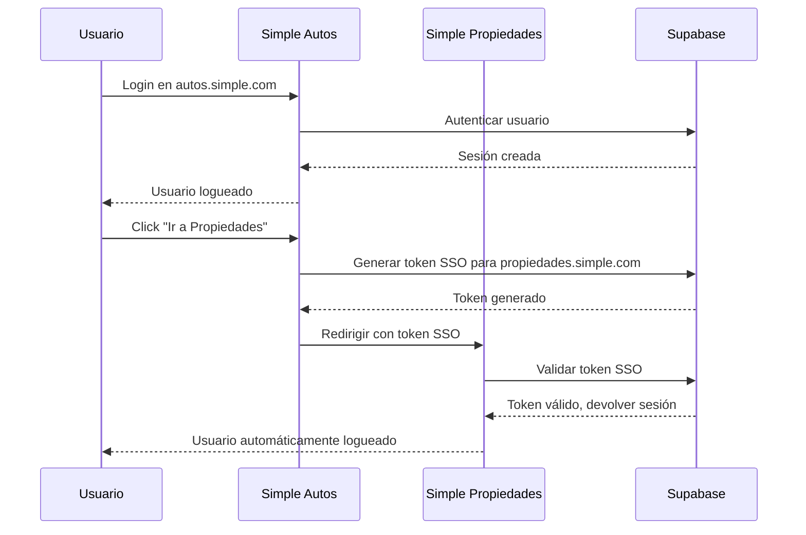

# Single Sign-On (SSO) - Simple Ecosystem

## 🎯 Visión General

El sistema de SSO permite a los usuarios autenticarse una vez y acceder automáticamente a todas las verticales del ecosistema Simple sin necesidad de volver a iniciar sesión.

## 🏗️ Arquitectura

### Componentes Principales

1. **Cliente SSO** (`packages/auth/src/sso/client.ts`)
   - Cliente Supabase compartido para SSO
   - Utilidades para generar y validar tokens de SSO

2. **Vertical Switcher** (`packages/auth/src/sso/VerticalSwitcher.tsx`)
   - Componente UI para cambiar entre verticales
   - Maneja la generación de tokens de acceso cruzado

3. **Página SSO** (`apps/*/src/app/auth/sso/page.tsx`)
   - Endpoint que recibe tokens de SSO
   - Valida tokens y establece sesiones

## 🔐 Flujo de Autenticación



## 🚀 Implementación

### 1. Variables de Entorno

Agregar a cada aplicación:

```bash
# Dominios de las verticales
NEXT_PUBLIC_AUTOS_DOMAIN=https://autos.simple.com
NEXT_PUBLIC_PROPIEDADES_DOMAIN=https://propiedades.simple.com
NEXT_PUBLIC_TIENDAS_DOMAIN=https://tiendas.simple.com
NEXT_PUBLIC_FOOD_DOMAIN=https://food.simple.com
NEXT_PUBLIC_CRM_DOMAIN=https://crm.simple.com

# Vertical actual
NEXT_PUBLIC_VERTICAL=autos
```

### 2. Base de Datos

La migración `20251204090000_add_sso_support.sql` ya provisiona todo el backend necesario:

- `user_verticals`: vínculo `user_id ↔ vertical` con permisos JSON y políticas RLS para que cada usuario sólo lea sus verticales. El service role puede administrar filas.
- `sso_tokens`: almacena tokens one-time con `expires_at`, `used_at` y metadatos para auditoría.
- RPCs:
  - `generate_sso_token(p_user_id, p_target_domain, p_expires_in)` → sólo service role.
  - `init_sso_token(p_target_domain, p_expires_in)` → usuarios autenticados; wrap de `generate_sso_token` que infiere `auth.uid()`.
  - `validate_sso_token(p_token, p_domain)` → valida/consume tokens (disponible para `anon`/`authenticated`).

> No repitas manualmente estas definiciones; simplemente corre `npm run supabase:db:push` para aplicar la migración en el entorno correspondiente.

### 3. Integración en la UI

Agregar el VerticalSwitcher al panel de usuario:

```tsx
import { VerticalSwitcher } from '@simple/auth';

export default function UserPanel() {
  return (
    <div>
      {/* Contenido del panel */}
      <VerticalSwitcher />
    </div>
  );
}
```

## 🔒 Seguridad

### Medidas Implementadas

1. **Tokens de corta duración** (5 minutos por defecto)
2. **Uso único** de tokens SSO
3. **Validación de dominio** de destino
4. **Row Level Security** en permisos de vertical
5. **PKCE flow** en Supabase Auth

### Mejores Prácticas

- Los tokens SSO expiran rápidamente
- Cada token solo puede usarse una vez
- Los dominios de destino están validados
- Los usuarios deben tener permisos explícitos para cada vertical

## 🎨 Experiencia de Usuario

### Flujo Ideal

1. **Login único**: Usuario se loguea en cualquier vertical
2. **Descubrimiento**: Ve otras verticales disponibles en el panel
3. **Acceso instantáneo**: Click en otra vertical = acceso inmediato
4. **Logout global**: Opción para cerrar sesión en todas las verticales

### Beneficios

- ✅ **Conveniencia**: Un solo login para todo el ecosistema
- ✅ **Seguridad**: Control granular de permisos por vertical
- ✅ **Escalabilidad**: Fácil agregar nuevas verticales
- ✅ **UX consistente**: Misma experiencia en todas las plataformas

## 📋 Checklist de Implementación

- [ ] Configurar variables de entorno en todas las verticales
- [ ] Crear tablas de base de datos para SSO
- [ ] Implementar funciones de base de datos
- [ ] Agregar VerticalSwitcher a la UI
- [ ] Crear páginas /auth/sso en cada vertical
- [ ] Probar flujo completo de SSO
- [ ] Configurar dominios de producción
