# Single Sign-On (SSO) - Simple Ecosystem

## 🎯 Visión General

El sistema de SSO permite a los usuarios autenticarse una vez y acceder automáticamente a todas las verticales del ecosistema Simple sin necesidad de volver a iniciar sesión.

## 🏗️ Arquitectura

### Componentes Principales

1. **Cliente SSO** (`packages/auth/src/sso/client.ts`)
   - Cliente HTTP compartido para `simple-api`
   - Utilidades para generar y validar tokens de SSO

2. **Vertical Switcher** (`packages/auth/src/sso/VerticalSwitcher.tsx`)
   - Componente UI para cambiar entre verticales
   - Maneja la generación de tokens de acceso cruzado

3. **Página SSO** (`apps/*/src/app/auth/sso/page.tsx`)
   - Endpoint que recibe tokens de SSO
   - Valida tokens y establece sesiones

## 🔐 Flujo de Autenticación

```mermaid
sequenceDiagram
    participant U as Usuario
    participant A as Simple Autos
    participant P as Simple Propiedades
    participant S as simple-api

    U->>A: Login en autos.simple.com
    A-->>U: Sesión local activa
    A-->>U: Usuario logueado

    U->>A: Click "Ir a Propiedades"
    A->>S: Generar token SSO para propiedades.simple.com
    S-->>A: Token generado
    A->>P: Redirigir con token SSO
    P->>S: Validar token SSO
    S-->>P: Token válido, devolver sesión
    P-->>U: Usuario automáticamente logueado
```



## 🚀 Implementación

### 1. Variables de Entorno

Agregar a cada aplicación:

```bash
# Dominios de las verticales
NEXT_PUBLIC_AUTOS_DOMAIN=https://autos.simple.com
NEXT_PUBLIC_PROPIEDADES_DOMAIN=https://propiedades.simple.com
NEXT_PUBLIC_TIENDAS_DOMAIN=https://tiendas.simple.com
NEXT_PUBLIC_FOOD_DOMAIN=https://food.simple.com
NEXT_PUBLIC_CRM_DOMAIN=https://crm.simple.com

# Vertical actual
NEXT_PUBLIC_VERTICAL=autos
```

### 2. Backend (simple-api)

SSO opera por endpoints del backend unificado:

- `POST /v1/sso/verticals`
  - Authorization: `Bearer <access_token>`
  - respuesta: `{ items: [{ vertical, permissions, active }] }`
- `POST /v1/sso/token`
  - Authorization: `Bearer <access_token>`
  - body: `{ targetDomain, expiresIn }`
  - respuesta: `{ token, expiresIn }`
- `POST /v1/sso/validate`
  - body: `{ token, domain? }`
  - respuesta: `{ valid, reason?, userId?, targetDomain?, expiresAt? }`

### 3. Integración en la UI

Agregar el VerticalSwitcher al panel de usuario:

```tsx
import { VerticalSwitcher } from '@simple/auth';

export default function UserPanel() {
  return (
    <div>
      {/* Contenido del panel */}
      <VerticalSwitcher />
    </div>
  );
}
```

## 🔒 Seguridad

### Medidas Implementadas

1. **Tokens de corta duración** (5 minutos por defecto)
2. **Firmados HMAC** (verificados en backend)
3. **Validación de dominio** de destino
4. **Backend único** desacoplado de RPCs de backend legado

### Mejores Prácticas

- Los tokens SSO expiran rápidamente
- Cada token solo puede usarse una vez
- Los dominios de destino están validados
- Los usuarios deben tener permisos explícitos para cada vertical

## 🎨 Experiencia de Usuario

### Flujo Ideal

1. **Login único**: Usuario se loguea en cualquier vertical
2. **Descubrimiento**: Ve otras verticales disponibles en el panel
3. **Acceso instantáneo**: Click en otra vertical = acceso inmediato
4. **Logout global**: Opción para cerrar sesión en todas las verticales

### Beneficios

- ✅ **Conveniencia**: Un solo login para todo el ecosistema
- ✅ **Seguridad**: Control granular de permisos por vertical
- ✅ **Escalabilidad**: Fácil agregar nuevas verticales
- ✅ **UX consistente**: Misma experiencia en todas las plataformas

## 📋 Checklist de Implementación

- [ ] Configurar variables de entorno en todas las verticales
- [x] Exponer endpoints SSO en `simple-api`
- [ ] Agregar VerticalSwitcher a la UI
- [ ] Crear páginas /auth/sso en cada vertical
- [ ] Probar flujo completo de SSO
- [ ] Configurar dominios de producción

